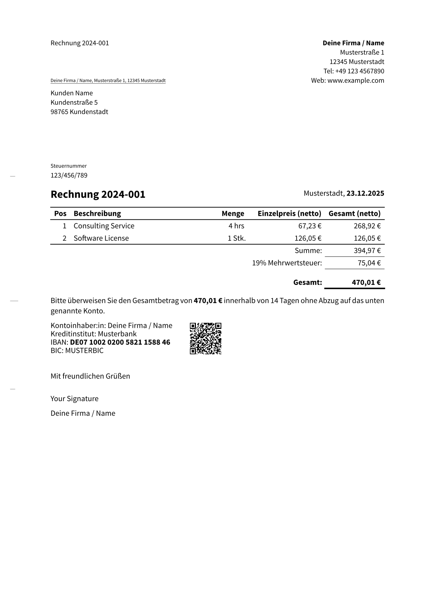

# invoice-pro

Modern Invoice Template for Typst

A professional, compliant, and automated invoice template for [Typst](https://typst.app). This package follows the German **DIN 5008** standard (Form A & B) and automates calculations, VAT handling, and payment details.



## Features

- **DIN 5008 Compliant:** Supports both Form A and Form B layouts.
- **Automatic Calculations:** Handles line items, sub-totals, and VAT (MwSt) automatically.
- **EPC QR-Code (GiroCode):** Generates a scannable banking QR code for easy payment apps using `rustycure`.
- **Flexible Tax Settings:** Supports standard VAT (Brutto/Netto modes).
  - **Kleinunternehmerregelung:** Built-in support for small business exemption (§ 19 UStG).
- **Internationalization:** Built-in support for German and English with customizable translations.
- **Customizable:** Easy configuration of sender, recipient, payment goals, and bank details.

## Getting Started

### Installation

Import the package at the top of your Typst file:

```typ
#import "@preview/invoice-pro:0.1.0": *
```

### Basic Usage

Here is a minimal example of how to create an invoice:

```typ
#import "@preview/invoice-pro:0.1.0": *

// Set language to German for correct date/number formatting and translations
#show: invoice.with(
  language: "de", // or "en" for English
  format: "DIN-5008-A", // or "DIN-5008-B"

  sender: (
    name: "Deine Firma / Name",
    address: "Musterstraße 1",
    city: "12345 Musterstadt",
    extra: (
      "Tel": [+49 123 4567890],
      "Web": [#link("https://www.example.com")[www.example.com]],
    )
  ),

  recipient: (
    name: "Kunden Name",
    address: "Kundenstraße 5",
    city: "98765 Kundenstadt"
  ),

  invoice-nr: "2024-001",
  date: datetime.today(),
  tax-nr: "123/456/789",
)

// Add Invoice Items
#invoice-line-items(
  item([Consulting Service], quantity: 4, unit: [hrs], price: 80),
  item([Software License], price: 150),
)

// Payment Terms
#payment-goal(days: 14)

// Bank Details with QR Code
#bank-details(
  bank: "Musterbank",
  iban: "DE07100202005821158846",
  bic: "MUSTERBIC",
)

#signature(signature: block[Your Signature])
```

## Configuration

### `invoice` arguments

| Argument | Type | Description |
| :--- | :--- | :--- |
| `language` | string \| dict | Language for translations: `"de"` (German, default) or `"en"` (English). Can also pass a custom translation dictionary. |
| `override-translations` | dict \| none | Custom translations to override specific strings in the selected language. |
| `format` | string | "DIN-5008-A" or "DIN-5008-B" (Default: B). |
| `sender` | dict | Sender details (`name`, `address`, `city`, `extra`). |
| `recipient` | dict | Recipient details. |
| `vat` | float | Default VAT rate (e.g., `0.19` for 19%). |
| `vat-exempt-small-biz` | bool | If `true`, enables "Kleinunternehmer" mode (no VAT). |
| `show-gross-prices` | bool | If `true`, calculates B2C gross prices. Default is `false` (B2B/Net). |

### `invoice-line-items` function

| Argument | Type | Description |
| :--- | :--- | :--- |
| `vat-exemption` | `bool` \| `auto` | Overrides the global setting. `auto` inherits from `invoice`. |
| `show-quantity` | `bool` \| `auto` | Controls the quantity column. `auto` hides it if all quantities are 1. |
| `show-vat-per-item` | `bool` \| `auto` | Controls the VAT column. `auto` shows it only if VAT rates differ between items. |
| `currency` | `content` | The currency symbol to display (Default: `[€]`). |
| `show-gross-prices` | `bool` | Calculation mode: `false` (Default/B2B) for net prices, `true` (B2C) for gross prices (prevents rounding errors). |
| `..items` | `arguments` | A list of `item()` calls. |


### `item` function

| Argument | Type | Description |
| :--- | :--- | :--- |
| `description` | content | Description of the service/product. |
| `price` | float | Price per unit. |
| `quantity` | float | Amount (Default: 1). |
| `vat` | float | Specific VAT rate for this item (overrides default). |

## Localization

The invoice-pro template supports multiple languages with built-in translations for German and English.

### Supported Languages

- `"de"` - German (Deutsch) - Default
- `"en"` - English - United Kingdom

### Changing Language

```typ
// English invoice
#show: invoice.with(
  language: "en",
  // ... other parameters
)
```

### Custom Translations

You can override specific translations for a language:

```typ
#show: invoice.with(
  language: "en",
  override-translations: (
    invoice: "Quote", // Change "Invoice" to "Quote"
    closing: "Best regards",
  ),
  // ... other parameters
)
```

### Custom Language Dictionary

For complete control, you can pass a custom translation dictionary:

```typ
#let my-translations = (
  id: "en",
  country: "GB",
  invoice: "Quote",
  recipient: "Recipient",
  // ... include all necessary keys
)

#show: invoice.with(
  language: my-translations,
  // ... other parameters
)
```

#### Line items with VAT exemption

```typst
#invoice-line-items(
  vat-exemption: true,
  item([Consulting Service], quantity: 4, unit: [hrs], price: 80),
  item([Software License], price: 150),
)
```


#### Line items B2C relation

```typst
#invoice-line-items(
  show-gross-prices: true,
  item([Fresh Mango], quantity: 4, unit: [pc.], vat: 0.07, price: 3.50),
  item([Döner Kebap to Go], unit: [pc.], price: 8),
)
```


#### Line items B2B relation

```typst
#invoice-line-items(
  item([Ergonomic Office Chair "Modell Air"], quantity: 10, price: 250.00, gross-price: false, unit: [pc.]),
  item([Monitor Mount VESA 100], quantity: 20, unit: [pc.], gross-price: false, price: 45.50),
  item([Shipment], quantity: 1, gross-price: false, price: 89.90),
)
```


### `payment-goal` function

| Argument   | Type                        | Description                                      |
| :--------- | :-------------------------- | :----------------------------------------------- |
| `days`     | int \| none                 | The number of days until payment is due.         |
| `date`     | datetime \| content \| none | A date until payment is due.                     |
| `currency` | `content`                   | The currency symbol to display (Default: `[€]`). |

```typst
#payment-goal()
```

> Bitte überweisen Sie den Gesamtbetrag von **123,45€** zeitnah ohne Abzug auf das unten genannte Konto.

```typst
#payment-goal(days: 14)
```

> Bitte überweisen Sie den Gesamtbetrag von **123,45€** innerhalb von 14 Tagen ohne Abzug auf das unten genannte Konto.

```typst
#payment-goal(date: datetime(day: 1, month: 1, year: 2026))
```

> Bitte überweisen Sie den Gesamtbetrag von **123,45€** bis spätestens 01.01.2026 ohne Abzug auf das unten genannte Konto.

## 🗺️ Roadmap

I am actively working on improving this template. Here is what's planned for future releases:

- [ ] **Refactored API:** Moving away from global states to a more robust, scoped API (inspired by CeTZ) for better stability and flexibility.
- [x] **Internationalization (i18n):** Built-in support for English and German with customizable translations.
- [ ] **Theming Engine:** Allow easy customization of accent colors and fonts to match corporate identities.
- [ ] **Data Loading:** Helper functions to load invoice items directly from JSON, CSV, or YAML files.
- [ ] **ZUGFeRD Support:** (Long-term goal) Embedding XML data for fully compliant e-invoicing.
- [ ] **Additional Languages:** Support for French, Spanish, and other languages (contributions welcome!).

Have an idea? Feel free to open an issue or pull request!

## Dependencies

This template relies on these amazing packages:

- `letter-pro` for the DIN layout.
- `rustycure` for QR-Code generation.
- `ibanator` for IBAN formatting.

**Acknowledgements:**

- Special thanks to [classy-german-invoice](https://github.com/erictapen/typst-invoice) by Kerstin Humm, which served as inspiration and provided the logic for the EPC-QR-Code implementation.

## License

MIT
