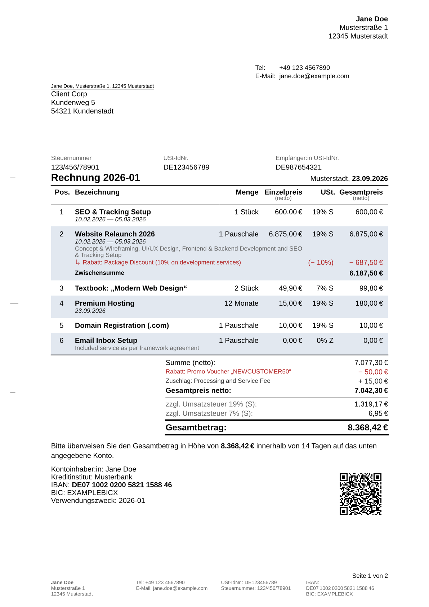

# invoice-pro

Modern Invoice Template for Typst

A professional, compliant, and automated invoice template for [Typst](https://typst.app) with integrated ZUGFeRD e-invoicing support. It automates calculations, VAT handling, and payment details, ships ten visual presets, and lays out the page for the window envelopes of the sender's country (German **DIN 5008** Form A & B by default).



## Features

- **Internationalization (i18n) (New in v0.3.0):** Built-in support for English and German out of the box, plus a highly flexible `locale` API to inject custom translations for any language.
- **Theming API (New in v0.5.0):** Ten presets, your brand color, fonts, and logo in one line, page layouts for window envelopes in several countries (DIN 5008 Form A & B, SN 010130, US #10, and more), and replaceable parts.
- **Validation (New in v0.5.0):** Missing invoice data is marked in a draft with a report page, or stops the build with `validation: "strict"`.
- **ZUGFeRD e-invoicing (New in v0.4.0):** (Experimental) Embed EN 16931-compliant Factur-X/ZUGFeRD XML metadata into your generated PDF/A-3B invoices for automated digital processing.
- **Block-based API:** Clean, scoped, and declarative data structure using `#line-items`, `#item`, `#group`, and `#bundle`—inspired by CeTZ, keeping your document clutter-free.
- **Automatic Calculations:** Effortlessly handles line items, nested bundles, sub-totals, and calculates taxes automatically.
- **EPC QR-Code (GiroCode):** Automatically generates a scannable banking QR code for quick and easy payments using banking apps.
- **Advanced Modifiers:** Apply specific discounts, surcharges, and custom tax rates at the item, bundle, or global level.
- **Highly Customizable:** Easy configuration of sender, recipient, payment terms, bank details, and visual themes to match your corporate identity.

## Documentation

For comprehensive guides, API references, theming instructions, and advanced examples, please visit our official documentation:

👉 **[Read the Full Documentation Here](https://leonieziechmann.github.io/invoice-pro/)**

## Getting Started

### Installation

Import the package at the top of your Typst file:

```typst
#import "@preview/invoice-pro:0.4.2": *
```

### Basic Usage

Here is an example of an invoice:

```typst
#import "@preview/invoice-pro:0.4.2": *

#show: invoice.with(
  locale: locale.en-de,
  sender: (
    name: "Your Company / Name",
    address: "1 Example Street",
    city: "12345 Example City",
    tax-nr: "123/456/789",
  ),
  recipient: (
    name: "Customer Name",
    address: "5 Customer Street",
    city: "98765 Customer City",
  ),
  invoice-nr: "2026-01",
)

// Add Invoice Items inside a scoped block
#line-items[
  #item(
    [Consulting & Concept],
    price: 85.00,
    quantity: 5,
    unit: "hrs",
  )

  #item(
    [Web Design Layout (Flat Rate)],
    price: 1200.00,
  )

  #item(
    [Stock Licenses (Images)],
    price: 25.00,
    quantity: 4,
  )

  #discount([Project Discount (Regular Customer)], amount: 10%)
]

// Payment Terms
#payment-terms(days: 14)

// Bank Details with QR Code
#bank-details(
  bank: "Example Bank",
  iban: "DE75512108001245126199",
  bic: "SOLADEST600",
)

#signature()
```

### Theming

The default theme, `theme.classic`, picks its page layout from the sender's country. Pick another preset and apply your brand in one line:

```typst
#show: invoice.with(
  theme: theme.elegant.with(theme.custom.brand(
    color: rgb("#0f766e"),
    logo: image("logo.svg", alt: "Your Company"),
  )),
  // sender: .., recipient: .., invoice-nr: ..
)
```


Presets: `classic` (default), `plain`, `corporate`, `elegant`, `prestige`, `bold`, `technical`, `soft`, `compact`, `boxed`. See the [Theming API](https://leonieziechmann.github.io/invoice-pro/api-reference/theme) for layouts, parts, and the migration from 0.4.

## API Stability

With the major refactoring introduced in version 0.2.0, the package structure is solidifying. Here is the current stability status of the various API components:

- **Invoice Header (`invoice` arguments):** **Mostly Stable**. The core invoice configuration is established. Future updates to the header will be non-breaking and will primarily consist of adding new optional fields.
- **Data Model (`#line-items`, `#group`, `#bundle`, `#item`):** **Stable**. The new block-based data model is considered almost finished and safe to use.
  - _Note:_ The `unit` argument in `#item`, `#group`, and `#bundle` supports dictionary inputs (e.g., `(display: "Std.", code: "HUR")`) to comply with the standardized unit formats and codes required for ZUGFeRD e-invoicing.
- **Theming (`theme`):** **Stable since v0.5.0**, with stability tiers: the calling convention, tokens, layout and area schema, part names, `theme.classic`, and `theme.plain` are frozen; options are provisional; the other presets and several layouts are experimental. v0.5.0 replaced the 0.4 `themes` namespace (see the migration guide in the documentation).
- **Localization (`locale`):** **Under Construction**. The localization and internationalization systems are actively being worked on and are subject to change.

## 🛠️ Development

This project uses **Nix** to provide a reproducible, sandboxed development environment. You do not need to install Typst, linters, or formatters globally—the flake provides everything.

### Try it out (No Install)

You can instantly compile a `.typ` file using the latest unreleased version of this template directly from GitHub, without entering a development shell:

```bash
nix run github:leonieziechmann/invoice-pro -- my-invoice.typ
# Or locally from the repository root:
nix run .#default -- my-invoice.typ
```

### Quick Start

1. **Enter the environment:**

```bash
nix develop
# or if you use direnv:
direnv allow
```

This activates a shell containing `typst`, `typstyle`, `markdownlint`, and `prettier`.

2. **Automatic Package Linking:**
   The environment automatically links the current directory to a sandboxed local package registry (inside `.typst-data`). You can import the package in your test files immediately without manual installation:

```typst
#import "@preview/invoice-pro:0.4.2": *
```

3. **Quality Control:**
   To run the full suite of Pull Request checks (linter, tests, and documentation build) locally before submitting a PR, you can use the built-in test runner:

```bash
check-pr
```

## 🗺️ Roadmap

I am actively working on improving this template. Here is what's planned for future releases:

- [x] (v0.2.0) **Refactored API:** Moving away from global states to a more robust, scoped API (inspired by CeTZ) for better stability and flexibility.
- [x] (v0.3.0) **Internationalization (i18n):** Built-in support for English and other languages (currently creates German invoices by default).
- [x] (v0.4.0) **ZUGFeRD Support:** (Experimental) Embedding XML data for fully compliant e-invoicing.
- [x] (v0.5.0) **Theming Engine:** Ten presets, brand colors, fonts, and logos, page layouts for window envelopes in several countries, and replaceable parts.
- [ ] **Data Loading:** Helper functions to load invoice items directly from JSON, CSV, or YAML files.

Have an idea? Feel free to open an issue or pull request!

## Dependencies

This template relies on these amazing packages:

- `sepay` for EPC-QR-Code generation.
- `ibanator` for IBAN formatting.
- `loom` for reactive document rendering.

**Acknowledgements:**

- Special thanks to [classy-german-invoice](https://github.com/erictapen/typst-invoice) by Kerstin Humm, which served as inspiration and provided the logic for the EPC-QR-Code implementation.
- The ZUGFeRD e-invoicing implementation was contributed by [Michael Fuchs (theexiile1305)](https://github.com/theexiile1305).
- Up to v0.4, the DIN 5008 page layout was drawn by [letter-pro](https://typst.app/universe/package/letter-pro). Since v0.5.0, invoice-pro draws its page frame itself.

## License

MIT
