# invoice-pro v0.5.0 Theming API: concept v2

Status: concept v2 for maintainer review (2026-09-22). It replaces concept v1 (2026-09-21) and describes the prototype after phase 4 and two fix stages (layouts and polish, Appendix C): the maintainer's decisions on Q1–Q9 and the three phase-4 rulings are applied, and every name is the final one. The runnable prototype is in `prototype/`; paths that start with `prototype/` are relative to this bundle, and commands run from `prototype/`. Every `typst` block in this document is a test: `python scripts/make-doc-tests.py` reads the blocks from this file (each is preceded by an invisible `<!-- doc-test: name -->` marker) and writes them verbatim to `prototype/tests/doc/<name>.typ`, after the docs prelude `prototype/tests/doc/prelude.typ`, which supplies `party` (sender, recipient, invoice number) and `body()`. Three blocks have fixed companions: the package block of walkthrough 9 becomes the test package's `lib.typ`, the TOML block becomes the P4 data file, and the §2.6 and §3.3 blocks get a hidden prefix (the names they use) and a hidden suffix (assertions). All 20 `typst` blocks are typstyle-formatted and compile on **Typst 0.15.1 and 0.14.2**. The prototype suite (`sh scripts/run-all.sh`) passes 752/752 on both compilers.

---

## Executive summary

**What a theme is.** A theme is a lazy value, like a locale: `theme.classic.with(..patches, layout: ..)`. It combines three things:

- a **page master written as data**: a _layout_ of named _areas_ that host _parts_;
- a **registry of part renderers** `(ctx, view) => content` that you wrap or replace;
- a **small frozen token tier**: 30 semantic tokens derived from one or two seed colours, plus provisional per-part options.

One strict patch engine, shared with `locale`, folds everything. invoice-pro owns the page frame (letter-pro is dropped). Core owns all compliance output: metadata, the ZUGFeRD attachment, legal notes, the EPC payload and the identity check.

**What phase 4 added.**

- **Validation levels.** `invoice(validation: "draft" | "strict" | none)`, default `"draft"`. A draft always renders: it marks missing data inline, puts a badge and a watermark on every page and appends a report page with the legal basis of each problem. `strict` stops the build, and `none` checks nothing. `--input invoice-pro-validation=..` overrides the parameter. Document data (§ 14 UStG, EN 16931) is now checked, not only the theme.
- **Ten presets** for different industries, on one shared looks kit: `classic`, `plain`, `corporate`, `elegant`, `prestige`, `bold`, `technical`, `soft`, `compact` and `boxed`. `modern` is gone.
- **Country layouts that follow the sender.** `layout: auto` picks the page master from the sender's country: DIN 5008 A (DE), DIN 5008 B (AT), SN 010130 (CH), an A4 right-window layout (FR, IT, ES), an A4 left-window layout (GB) and US #10 (US). Each window layout lists the envelopes it was verified against. `theme.custom.proof(true)` prints the windows on the sheet, so you can hold it against a real envelope. CI renders a 4-item invoice for every preset and every sender region with `layout: auto` and requires exactly one page (80 checks). The Swiss layouts reserve no QR-bill zone; the zone is an explicit 0.5.x opt-in, `theme.layout.reserve-qr-bill(..)`.
- **Final names.** The semantic rename map was applied throughout, for example `region` → `area`, `x`/`y` → `left`/`top`, `resolve-theme` → `resolve` and `notices` → `notes` (§2.7).
- **API gaps closed.** Designing eight looks exposed twelve gaps. The prototype now has a computed bottom margin, a totals row model, table knobs, label and numeric font roles, radii, `checks.pairs`, locale section strings, and a widow rule that keeps the totals with the last item row.

**Compiler.** No minimum-compiler bump. Everything runs on Typst 0.14.2 and 0.15.1 with the same results (§13). Only the combined export `--pdf-standard a-3a,ua-1` needs 0.15.

**Cost.** About 34–46 maintainer-days for 0.4.3 plus 0.5.0 (§15), up from 25–35 in v1. The increase comes from validation, eight more presets and the country layouts.

**What I need from you:** the open questions at the end of Appendix A. Above all, O1 (resolved in the prototype, please confirm): a Swiss sender now gets `sn-010130-right` without a QR-bill zone, and the zone is opt-in. Please also review the design changes the one-page rule made (O8).

## Design decisions at a glance

| Decision         | Choice                                                                                     | Why                                                  |
| ---------------- | ------------------------------------------------------------------------------------------ | ---------------------------------------------------- |
| Central model    | layout (areas host parts) × parts registry × tokens/options                                | any format becomes data                              |
| Namespace        | singular `theme` (Q1); `theme.layout`, `theme.custom` mirror `locale.region/custom`        | one rule: the namespace is named after the parameter |
| Named arguments  | only `layout:`; others panic, and 0.4 names point to the migration table                   | `.with` replaces named dicts wholesale               |
| Default layout   | `layout: auto` resolves from the **sender's** country (`env.region`); explicit always wins | envelopes and paper belong to the sender             |
| Layout vs look   | layout is the bottom layer; looks patch only look-safe area fields                         | any look on any layout (CI lint)                     |
| Presets          | 10; `classic`, `plain` frozen; the others experimental; names stable                       | industries differ; appearance may evolve (Q9)        |
| Patch DSL        | typed helper per group; `auto` untouched, `none` off, `reset()` default                    | house idiom                                          |
| Merge            | one strict deep merge, area fields included; exclusive anchor pairs                        | fixes the shallow merge                              |
| Tokens           | 30 frozen, each with a proven consumer                                                     | no freeze without a reference                        |
| Parts            | `(ctx, view) => content`, wrap with `inner`; custom names prefixed                         | protects future built-ins                            |
| Validation       | `draft` (default) / `strict` / `none`; misuse always panics                                | never lose the preview; CI enforces strict (Q3)      |
| Issue classes    | data, e-invoice, theme, lint; data and e-invoice issues withhold the XML in draft          | an incomplete e-invoice must not be sent             |
| `none` + ZUGFeRD | XML attached as built ("off means off")                                                    | a switch that half-works is worse                    |
| Requirements     | table keyed by `env.kind`; 0.5.0 ships the invoice row                                     | new kinds are rows                                   |
| Identity         | number and date must appear in the tagged first-page output (checked after layout)         | placement alone was not enough                       |
| Frame            | core-owned; bottom margin computed from the footer (`margin.bottom: auto`)                 | legal lines cannot fall off                          |
| Envelopes        | window layouts declare envelopes; fit is checked; `proof()` overlay                        | "just works" without a guarantee                     |
| Compliance       | core (root, measure), never a part                                                         | a replaced part cannot drop it                       |
| Compiler         | stay on 0.14; tested on 0.14.2 and 0.15.1 (Q2)                                             | only one export flag differs                         |
| Deferred         | QR-bill component, reserved zones, NF/UK masks, `adjust`, table rewrite, more kinds        | all additive                                         |

---

## 1. Pitch & mental model

Every invoicing product separates three things: the page master (paper, window, letterhead, footer zones), the brand (logo, colours, fonts) and the content style (table, totals). invoice-pro 0.4 fuses all three into `themes.DIN-5008(...)` and delegates the geometry to a third-party package. v0.5.0 separates them:

> **Data decides _what_, core decides _where_, the theme decides _how_, and the document decides how strict.**

```text
                   theme.classic.with(brand, tweaks)          (layout: auto -> by sender country)
                                     |  lazy: nothing happens until invoice() calls it
                                     v
 invoice() -- injects --> base: schema object of the RUNNING version
                          env: (kind, lang, region = SENDER country, e-invoice)
                                     |
      +---------- fold (one strict engine, utils/patch.typ) --------------+
      | L0 schema defaults (tokens, options, parts, checks) + stubs       |
      | L1 LAYOUT (page master)  <- `layout:` dict or resolver env => ..  |
      | L2 look patches (preset) <- look-safe area fields, never geometry |
      | L3 positional patches in call order (brand, company, document)    |
      +-------------------------------+-----------------------------------+
         resolve (t => v, fixpoint) -> validate: misuse PANICS, the rest -> theme.issues
                                     v
   invoice(validation: draft | strict | none)   <- --input invoice-pro-validation wins
         + document data checks (§ 14 UStG, EN 16931)  -> issues
                                     v
                 ctx.theme (ONE sealed key)  +  ctx.validation (level, issues)
        +----------------------------+-----------------------------+
        v                            v                             v
   CORE (not themable)         FRAME (core)                  COMPONENTS (body)
   set document, lang,         set page; areas -> PARTS      line-items, bank-details,
   factur-x.xml (withheld      (frame view); identity;       payment-terms, signature
   in draft on data issues),   footer fit; draft markers,    -> PARTS (body views)
   EPC payload, notes          badge, watermark, report
        L4 themed(..patches)[subtree]   L5 explicit component args
```

| Concept    | Is                                                                                                         | Tier in 0.5.0                             |
| ---------- | ---------------------------------------------------------------------------------------------------------- | ----------------------------------------- |
| **Layout** | data: paper, margin, marks, stationery, envelopes, named **areas** (geometry, page selector, hosted parts) | layout and area schema frozen             |
| **Part**   | a renderer `(ctx, view) => content` with a documented view; wrap or replace                                | names, signature, bold view fields frozen |
| **Token**  | 30 semantic design decisions derived from one or two seeds                                                 | frozen                                    |
| **Option** | a knob of one built-in part (`items-table.zebra`)                                                          | provisional                               |
| **Patch**  | a dict in patch shape, usually produced by a `theme.custom.*` helper                                       | helper mechanism and merge rules frozen   |
| **Issue**  | a finding that follows the validation level (data, e-invoice, theme, lint)                                 | classes frozen; rows and ids provisional  |

The customization ladder has no cliff between the rungs:

1. `theme.classic` (the default) or another preset such as `theme.elegant`.
2. `.with(theme.custom.brand(color:, logo:))`.
3. `.with(layout: theme.layout.din-5008-b)`, plus `marks(none)` and `stationery(..)`.
4. `area("letterhead", parts: ("sender", "logo"))`: the logo moves right, as data.
5. `wrap("totals", ..)` or `part("payment-terms", ..)`.
6. Your own layout dict with custom areas and prefixed custom parts.

---

## 2. Public API surface

### 2.1 Exports

| Export                                                                                    | Content                                                                                                                                                                                                                                                                                                          | Tier                                         |
| ----------------------------------------------------------------------------------------- | ---------------------------------------------------------------------------------------------------------------------------------------------------------------------------------------------------------------------------------------------------------------------------------------------------------------- | -------------------------------------------- |
| `invoice(theme: .., validation: ..)`                                                      | `theme`: a lazy theme, default `theme.classic`; `validation`: `"draft"` (default), `"strict"` or `none` (§7)                                                                                                                                                                                                     | frozen                                       |
| `theme.classic`, `theme.plain`                                                            | presets                                                                                                                                                                                                                                                                                                          | frozen                                       |
| `theme.corporate`, `elegant`, `prestige`, `bold`, `technical`, `soft`, `compact`, `boxed` | presets (§9)                                                                                                                                                                                                                                                                                                     | names stable; look experimental              |
| `theme.layout`                                                                            | 16 layouts (§8.1), `derive(base, ..patches)`, the envelope catalogue `envelope`, `folded(..)`, the region functions `for-region`, `paper-for-region`, `digital-for-region`, `plain-for-region`, `sidebar-for-region`, `band-for-region`, `dense-for-region`, and `reserve-qr-bill(layout)` (0.5.x preview, §8.1) | per layout (§8.1)                            |
| `theme.custom`                                                                            | the patch DSL (§2.4), `reset`, `replace`; `from-data` (experimental). A facade (`prototype/src/public/custom.typ`): internal helpers of the implementation do not leak                                                                                                                                           | frozen mechanism, provisional option helpers |
| `theme.resolve(theme, env:, validation:)`                                                 | evaluate a lazy theme outside an invoice (tests, package CI); `validation: "strict"` by default                                                                                                                                                                                                                  | frozen                                       |
| `theme.parts`                                                                             | the default renderers as a module (`theme.parts.totals(ctx, view)`)                                                                                                                                                                                                                                              | names frozen                                 |
| `theme.contrast`, `theme.on-color`, `theme.legible`                                       | colour helpers; `legible(fg, bg, target: 4.5)` darkens or lightens `fg` until it reaches the target                                                                                                                                                                                                              | stable                                       |
| `themed(..patches)[..]`                                                                   | subtree override (a body verb, like `apply`)                                                                                                                                                                                                                                                                     | experimental                                 |
| `payment-terms(days:, date:)`                                                             | the component (was `payment-goal`)                                                                                                                                                                                                                                                                               | frozen                                       |
| locale `strings.validation.issues`, `roles`                                               | report texts of the theme and lint issues, keyed by the issue's `key` and applied to its `args` (§7.3); de, en, fr, it, es, base                                                                                                                                                                                 | provisional                                  |

`build-theme` stays internal, and so does the looks kit (`prototype/src/theming/looks/kit.typ`). `prototype/tests/polish/exports.typ` pins the exported names of every public module to the documented lists, so an internal helper cannot become API by accident.

### 2.2 The lazy theme

```text
/// A lazy theme. Pass it UNCALLED; customise with `.with(..patches, layout: ..)`.
/// Calling it without an injected base is identical to `.with` (idempotent).
(
  ..patches,        // dictionary | array | none: applied in call order ON TOP of the layout
  layout: auto,     // auto | dictionary | function (env) => dictionary
                    //   auto: the preset's default, resolved from env.region (the sender)
                    //   chained `.with(layout: ..)`: last wins
  base: none,       // injected by invoice(): the running version's schema object
  env: none,        // injected by invoice(): (kind, lang, region, e-invoice)
)
```

Any other named argument panics, and the message names the 0.4 parameters: ``theme `classic`: unexpected named argument(s) `form`. ... `form` is a 0.4 `themes.DIN-5008` parameter; see the migration table in the theme docs.`` A layout resolver that returns something other than a dict panics too (error case 40).

### 2.3 Presets

Ten presets ship. §9 describes each with its audience, idea, default layout and a figure. All of them compile on every layout, because looks patch only look-safe fields of standard area names (CI: 10 presets × 17 layouts, `layout: auto` included). Compiling is not the same as looking right, so the fix stages added visual guards: the dense header row renders cleanly with every look (20 checks), the serif letterhead fits every letterhead box with long names and wide or tall logos (a unit test plus 64 renders), and a 4-item invoice needs exactly one page for every preset in every sender region (80 checks). `minimal` stays a docs recipe.

### 2.4 `theme.custom`: the patch DSL

There is one helper per schema group, named after it. Every parameter defaults to `auto` (untouched), `none` means off, and `reset()` restores the default. Each helper returns a **one-element array**, so any number of helpers in a `{ import theme.custom: * .. }` block all apply. `prototype/tests/coverage.typ` asserts helper parameters == schema keys, in both directions.

| Helper                                                                                                | Group   | Parameters                                                                                         | Tier         |
| ----------------------------------------------------------------------------------------------------- | ------- | -------------------------------------------------------------------------------------------------- | ------------ |
| `colors`                                                                                              | tokens  | primary, on-primary, primary-text, accent, accent-text, text, text-muted, border, tint, background | frozen       |
| `fonts`                                                                                               | tokens  | body, heading, label, numeric, number-width; regulated (0.5.x)                                     | frozen       |
| `sizes`                                                                                               | tokens  | body, small, fine, large, title                                                                    | frozen       |
| `weights`                                                                                             | tokens  | strong                                                                                             | frozen       |
| `strokes`                                                                                             | tokens  | hairline, thin, regular, thick                                                                     | frozen       |
| `spacing`                                                                                             | tokens  | small, medium, leading                                                                             | frozen       |
| `radii`                                                                                               | tokens  | small, medium                                                                                      | frozen       |
| `page`                                                                                                | layout  | paper, flipped, margin, body-top, body-gap, header-ascent, footer-descent, footer-clearance        | frozen       |
| `stationery(value)`                                                                                   | layout  | `none`, `"pre-printed"` or `(first:, rest:)`                                                       | frozen       |
| `marks(none)` / `marks(..)`                                                                           | layout  | fold, punch, left, length, stroke                                                                  | frozen       |
| `envelopes(..records)`                                                                                | layout  | envelope records (§8.2); replaces the list                                                         | stable       |
| `proof(value)`                                                                                        | layout  | `true`, `false` or an array of envelope names                                                      | stable       |
| `area(name, ..)` / `area(name, none)`                                                                 | layout  | the area fields (§3.4)                                                                             | frozen       |
| `part(name, renderer)` / `wrap(name, wrapper)`                                                        | parts   | `(ctx, view) => content` / `(ctx, view, inner) => content`                                         | frozen       |
| `brand`                                                                                               | macro   | color, accent, font, heading-font, logo                                                            | frozen       |
| `reset()`, `replace(v)`                                                                               | markers | schema default / wholesale value                                                                   | frozen       |
| `checks`                                                                                              | checks  | min-contrast, pairs                                                                                | stable       |
| `logo`, `title`, `line-items`, `items-table`, `totals`, `bank-details`, `page-number`, `continuation` | options | §3.5                                                                                               | provisional  |
| `row`                                                                                                 | options | fill (captured inside `themed`)                                                                    | experimental |
| `from-data(data, assets:)`                                                                            | data    | a brand file as a patch                                                                            | experimental |

### 2.5 `themed` (experimental)

`themed(..patches, body)` re-themes a subtree: tokens, options, checks and **body** parts. Derived values re-derive inside the scope. Layout patches, frame parts and frame options panic, because the frame is drawn once per document. Scoped findings follow the validation level; in draft their ids carry the prefix `themed/`.

### 2.6 Passing a theme

<!-- doc-test: passing -->

```typst
#let a = theme.classic                                           // the default
#let b = theme.classic.with(layout: theme.layout.us-letter-digital) // another page master
#let c = theme.corporate.with(acme-brand)                           // a brand is a patch array
#let d = theme.classic.with(acme.patch, layout: acme.sidebar-a5) // a zero-import package
#show: invoice.with(theme: d, locale: locale.de-de, ..party)
```

`acme-brand` is a `theme.custom.brand(..)` result and `acme` an imported theme package (walkthrough 9); the hidden prefix defines both.

### 2.7 Migration and renames

**From 0.4 (R44).**

| 0.4                                                  | 0.5.0                                                                                           |
| ---------------------------------------------------- | ----------------------------------------------------------------------------------------------- |
| `theme: themes.DIN-5008()`                           | nothing (`theme.classic` with `layout: auto`; a German sender gets DIN 5008 A)                  |
| `themes.DIN-5008(form: "B")`                         | `theme.classic.with(layout: theme.layout.din-5008-b)`                                           |
| `font: "Inter"`                                      | `theme.custom.fonts(body: ("Inter", "Libertinus Serif"))` or `brand(font: ..)`                  |
| `hole-mark: false`                                   | `theme.custom.marks(punch: none)`                                                               |
| `folding-marks: false`                               | `theme.custom.marks(fold: ())`; everything off: `marks(none)`                                   |
| `color-row-odd: a, color-row-even: b` (PR #36)       | `theme.custom.items-table(zebra: (a, b))`                                                       |
| `margin: (..)`                                       | `theme.custom.page(margin: (..))`: partial dicts fold; the bottom margin is computed by default |
| `footer: [..]` (page 1 only)                         | `theme.custom.area("footer", parts: ([..], "registration"))`: every page, `info.*` motifs work  |
| `theme: themes.blank`                                | `theme: theme.plain` (prints sender, title, recipient and the registration block)               |
| a native `set page(..)` before `invoice`             | lost: the frame owns `set page`. Use `page(..)`, `marks(..)` or a layout                        |
| `blank.with(document: ..)` as a test hook (11 tests) | `theme.resolve(..)` assertions, or `part("references", ..)` stubs                               |
| `.with(line-items: ..)` (6 tests, #39, #41)          | `wrap("totals", ..)` over `view.totals.rows`, or `part("items-table", ..)`                      |
| `payment-goal(days: 14)`                             | `payment-terms(days: 14)`                                                                       |
| a missing field printed `#recipient.name`            | draft marker ‹fehlt: …›, or a strict panic (§7)                                                 |

**From concept v1 (Q7).** The names were never released, so there are no aliases. The strict merge rejects every old key with the list of allowed keys (`prototype/scripts/checks-naming.sh` proves it for `x`, `brand`, `regions`, `sizes.base` and `bank-details.qr`).

| Concept v1                                                 | v2                                                                                           |
| ---------------------------------------------------------- | -------------------------------------------------------------------------------------------- |
| region, `regions:`, `region(..)`, `view.region`            | area, `areas:`, `area(..)`, `view.area`                                                      |
| area anchors `x`, `y`; `marks.x`; envelope window `x`, `y` | `left`, `top` (exclusive with `right`, `bottom`)                                             |
| area flag `brand: true`                                    | `stationery: true`                                                                           |
| `stationery: "generated"` (default)                        | `stationery: none`; other values are misuse (case 41)                                        |
| `theme.resolve-theme(..)`                                  | `theme.resolve(..)`                                                                          |
| `theme.layout.letter-digital`                              | `theme.layout.us-letter-digital`                                                             |
| `fonts.figures`, `sizes.base`, `spacing.sm`, `spacing.md`  | `fonts.number-width`, `sizes.body`, `spacing.small`, `spacing.medium`                        |
| `title.layout: "line" \| "stacked"`, `title.fill`          | `title.arrange: "row" \| "stack"`, `title.color`                                             |
| `line-items.decrease-color`, `increase-color`              | `discount-color`, `surcharge-color`                                                          |
| `totals.emphasis-fill`, `bank-details.qr`                  | `totals.fill`, `bank-details.show-qr`                                                        |
| `sender.show-extra` (option group `sender`)                | removed: `part("sender-details", none)` or leave it out of the area                          |
| parts `sender-extra`, `info-block`, `register`, `notices`  | `sender-details`, `reference-list`, `registration`, `notes`                                  |
| kinds `proforma`, `reminder`                               | `proforma-invoice`, `payment-reminder`                                                       |
| requirements `where: "page-1"`, `printed-ok`               | `where: "first-page"`, `waived-by-stationery`                                                |
| `page-number.from: 2`, `format: (current, total) => ..`    | `from: auto` (every page when there is more than one), `format: (ctx, current, total) => ..` |
| preset `modern`                                            | `corporate` (§9)                                                                             |
| `checks.min-contrast` panics                               | contrast findings are lint issues and follow the level                                       |

Where "region" means a country, it stays: `env.region`, `text(region:)`, `for-region` and its siblings.

---

## 3. Schemas (complete key listing)

The schema is written once (`prototype/src/theming/schema.typ`) as `field(default, ..types)` leaves; defaults and types derive mechanically. In tokens and options **a function is a derivation** `t => value` unless the field's types include `function` (then it is a callback); array elements may always be derivations. The area fields `fill`, `stroke`, `gap`, `text`, `par`, `radius` and `rule` may derive. `options.custom` is opaque.

### 3.1 The resolved theme (what parts see in `ctx.theme`)

| Key                     | Type                                      | Tier                                             | Meaning                                                                               |
| ----------------------- | ----------------------------------------- | ------------------------------------------------ | ------------------------------------------------------------------------------------- |
| `__invoice-pro-theme__` | version string                            | stable                                           | type tag                                                                              |
| `meta`                  | `(name, schema)`                          | stable                                           | provenance                                                                            |
| `env`                   | `(kind, lang, region, e-invoice)`         | kind, lang, region frozen; e-invoice provisional | injected context; `region` = sender country, lower case                               |
| `layout`                | layout (§3.3), resolved, areas normalized | frozen                                           | page master                                                                           |
| `parts`                 | `dict<str, function or none>`             | names frozen                                     | renderers (§3.6)                                                                      |
| `tokens`                | §3.2, fully resolved                      | frozen                                           | what parts read                                                                       |
| `options`               | §3.5, resolved                            | provisional                                      | per-part knobs                                                                        |
| `checks`                | §3.7                                      | stable                                           | validation switches                                                                   |
| `requirements`          | `(roles, parts)` for `env.kind`           | provisional                                      | §5.3                                                                                  |
| `issues`                | array of issue records (§7.2)             | provisional                                      | the theme's own findings, before the level is applied                                 |
| `unread-options`        | array of option group names               | provisional                                      | changed groups that no active built-in renderer reads (informational, never an issue) |
| `spec`, `base`          | –                                         | internal                                         | unresolved tree (for `themed`), injected schema                                       |

### 3.2 Tokens: the frozen semantic tier (30 leaves)

Rule: **a token is frozen only if a built-in part or preset reads it.** `prototype/scripts/mutation.sh` sets each token to an extreme value and asserts that a render of `classic`, `corporate`, `technical`, `prestige` or "rail" (classic with a dark letterhead) changes. All 30 pass; nothing is pending.

| Path                  | Type                                 | Default                                   | Read by                                                  |
| --------------------- | ------------------------------------ | ----------------------------------------- | -------------------------------------------------------- |
| `colors.primary`      | color                                | `#1f2937`                                 | seed; fills, rails, header fills                         |
| `colors.on-primary`   | color                                | `t => on-color(primary)`                  | text on primary fills                                    |
| `colors.primary-text` | color                                | `t => legible(primary, background)`       | the brand colour used as text (titles, kickers)          |
| `colors.accent`       | color                                | `t => primary`                            | second seed; rules and ticks                             |
| `colors.accent-text`  | color                                | `t => legible(accent, background)`        | accent used as text (technical markers, prestige labels) |
| `colors.text`         | color                                | `black`                                   | body text, marks                                         |
| `colors.text-muted`   | color                                | `luma(100)`                               | descriptions, labels, notes, footer, continuation        |
| `colors.border`       | color                                | `black`                                   | table rules                                              |
| `colors.tint`         | color or none                        | `t => tint-of(primary)`                   | zebra, soft fills; the default seed gives `#e2e8f0`      |
| `colors.background`   | color                                | `white`                                   | page fill (when not white), contrast reference           |
| `fonts.body`          | str or array                         | `("Liberation Sans", "Libertinus Serif")` | all text; chains end in an embedded family               |
| `fonts.heading`       | str or array                         | `t => body`                               | title, headings                                          |
| `fonts.label`         | str or array                         | `t => body`                               | column headers, section and reference labels             |
| `fonts.numeric`       | str or array                         | `t => body`                               | amounts, quantities, IBAN, reference numbers             |
| `fonts.number-width`  | `"tabular"` or `"proportional"`      | `"tabular"`                               | `number-width` of amounts (R4)                           |
| `sizes.body`          | length                               | `10pt`                                    | body                                                     |
| `sizes.small`         | length                               | `0.85em`                                  | sub-labels, references, page number                      |
| `sizes.fine`          | absolute length, at least 6pt (lint) | `7pt`                                     | return address, legal footer                             |
| `sizes.large`         | length                               | `1.2em`                                   | grand total                                              |
| `sizes.title`         | length                               | `1.4em`                                   | title                                                    |
| `weights.strong`      | str or int                           | `"bold"`                                  | the single bold mechanism, table header                  |
| `strokes.hairline`    | length                               | `0.25pt`                                  | marks                                                    |
| `strokes.thin`        | length                               | `0.5pt`                                   | table rules, continuation line                           |
| `strokes.regular`     | length                               | `1pt`                                     | table header rule                                        |
| `strokes.thick`       | length                               | `2pt`                                     | totals rule                                              |
| `spacing.small`       | length                               | `0.4em`                                   | cell inset, row inset                                    |
| `spacing.medium`      | length                               | `0.6em`                                   | header inset, area gap, flow-area spacing                |
| `spacing.leading`     | length                               | `0.65em`                                  | paragraph leading of the body flow and table cells       |
| `radii.small`         | length                               | `2pt`                                     | filled blocks (totals fill, payable bar)                 |
| `radii.medium`        | length                               | `4pt`                                     | cards, the logo plate on a dark surface                  |

`fonts.regulated` (default `("Liberation Sans", "Arial", "Helvetica", "Libertinus Serif")`) exists for the 0.5.x reserved zones and is not frozen. Strokes are composed as `thickness + paint` at the use site. Tokens grow only additively.

**Font rule.** Packages cannot ship fonts, and Typst embeds only Libertinus Serif, New Computer Modern and DejaVu Sans Mono. Every chain in the schema and in the presets therefore ends in an embedded family, and each preset is tested with `--ignore-system-fonts`.

### 3.3 Layout (page master)

| Key                               | Type                                                           | Default                                                          | Meaning                                                                                                                                        |
| --------------------------------- | -------------------------------------------------------------- | ---------------------------------------------------------------- | ---------------------------------------------------------------------------------------------------------------------------------------------- |
| `name`                            | str                                                            | `"plain"`                                                        | shown in errors                                                                                                                                |
| `paper`                           | Typst paper name, or `(width: length, height: length or auto)` | `"a4"`                                                           | ISO A/B/C 0–10 and US sizes are known (computed); `height: auto` = continuous roll                                                             |
| `flipped`                         | bool                                                           | `false`                                                          | landscape                                                                                                                                      |
| `margin`                          | sides                                                          | `(top: 20mm, right: 20mm, bottom: auto, left: 25mm)`             | partial patches fold; `bottom: auto` = tallest footer + `footer-descent` + `footer-clearance`, at least 20 mm; `auto` on other sides is misuse |
| `header-ascent`, `footer-descent` | relative                                                       | `30%`                                                            | passed to `set page`; `footer-descent` of 100 % or more is misuse                                                                              |
| `footer-clearance`                | length                                                         | `5mm`                                                            | the last footer line ends at least this far above the sheet edge (unprintable rim)                                                             |
| `body-top`                        | auto or length                                                 | `auto`                                                           | page-absolute y of the first-page body; auto = below the lowest reserving area + `body-gap`                                                    |
| `body-gap`                        | length                                                         | `4.23mm`                                                         |                                                                                                                                                |
| `stationery`                      | `none`, `"pre-printed"` or `(first:, rest:)`                   | `none`                                                           | anything but `none` drops `stationery: true` areas; art is stretched to the sheet                                                              |
| `marks`                           | none or `(fold, punch, left, length, stroke)`                  | `none` (template `((), none, 5mm, 2.5mm, t => hairline + text)`) | read by the `marks` part                                                                                                                       |
| `envelopes`                       | array of envelope records (§8.2)                               | `()`                                                             | window proof and fit check                                                                                                                     |
| `proof`                           | bool or array of envelope names                                | `false`                                                          | print-proof overlay (§8.3)                                                                                                                     |
| `areas`                           | `dict<str, area or none>`                                      | standard stubs                                                   | ordered, open names, closed records; `none` = removed                                                                                          |

DIN 5008 form A in full (the other layouts are in `prototype/src/theming/layouts.typ`):

<!-- doc-test: din -->

```typst
#let din-5008-a = (
  name: "din-5008-a",
  paper: "a4",
  margin: (top: 20mm, right: 20mm, bottom: auto, left: 25mm), // bottom: footer + descent + clearance
  marks: (fold: (87mm, 192mm), punch: 148.5mm, left: 5mm, length: 2.5mm), // stroke: hairline + text
  envelopes: E.folded(
    (87mm, 192mm),
    E.envelope.din-dl,
    E.envelope.din-c6-5,
    E.envelope.din-c5-a,
    E.envelope.din-c4-a,
  ),
  areas: (
    marks: (place: "background", parts: ("marks",)),
    letterhead: (
      left: 25mm,
      top: 8mm,
      width: 165mm,
      height: 19mm,
      stationery: true,
      par: (leading: 0.5em),
      parts: ("logo", "sender"),
      arrange: (columns: (1fr, auto), align: (left + horizon, right + top)),
    ),
    address: (
      left: 20mm,
      top: 27mm,
      width: 85mm,
      height: 45mm,
      inset: (left: 5mm, right: 5mm),
      par: (leading: 0.5em),
      parts: ("return-address", "recipient"),
      gap: 0pt,
      arrange: (rows: (17.7mm, 27.3mm), align: (left + bottom, left + top)),
    ),
    info: (
      left: 125mm,
      top: 32mm,
      width: 75mm,
      height: 40mm,
      parts: ("sender-details",),
    ),
    references: (place: "before", parts: ("references",)),
    title: (place: "before", parts: ("title",)),
    continuation: (place: "header", pages: "rest", parts: ("continuation",)),
    page-number: (place: "footer", parts: ("page-number",), align: right),
    footer: (
      place: "footer",
      stationery: true,
      text: (size: t => t.sizes.fine, fill: t => t.colors.text-muted),
      par: (leading: 0.45em),
      parts: ("company", "contact", "registration", "bank-account"),
      arrange: (columns: (1fr, 1fr, 1fr, 1fr)),
    ),
  ),
)
#let din-5008-b = derive(din-5008-a, (
  layout: (
    name: "din-5008-b",
    marks: (fold: (105mm, 210mm)),
    envelopes: E.folded(
      (105mm, 210mm),
      E.envelope.din-dl,
      E.envelope.din-c6-5,
      E.envelope.din-c5-b,
    ),
    areas: (
      letterhead: (height: 37mm),
      address: (top: 45mm),
      info: (top: 50mm),
    ),
  ),
))
```

The hidden prefix is `#let derive = theme.layout.derive` and `#let E = theme.layout`; the hidden suffix asserts that the listing resolves equal to the shipped data. The recipient sits DIN-exactly 17.7 mm inside the address field, and its text stops at 100 mm (the DL window minus the 10 mm sideways play of an A4 sheet in a DL envelope).

### 3.4 Area (closed record, every field typed)

| Key                | Type                                                                                                | Default                                                                    | Merge                                                                       |
| ------------------ | --------------------------------------------------------------------------------------------------- | -------------------------------------------------------------------------- | --------------------------------------------------------------------------- |
| `place`            | `"fixed"`, `"before"`, `"after"`, `"header"`, `"footer"`, `"background"`, `"foreground"`            | `"fixed"`                                                                  | replace                                                                     |
| `pages`            | auto, `"all"`, `"first"`, `"rest"`, `"last"`, `"not-last"`                                          | auto: `"first"` for fixed/flow, `"all"` for running and layer places       | replace; set on a flow area: misuse                                         |
| `left` / `right`   | auto or length/ratio/relative                                                                       | auto                                                                       | exclusive: setting one clears the other                                     |
| `top` / `bottom`   | auto or length/ratio/relative                                                                       | auto                                                                       | exclusive; `bottom` needs `height`                                          |
| `width`, `height`  | auto or length/ratio/relative                                                                       | auto (paper width for fixed, text width in the flow)                       | replace                                                                     |
| `parts`            | array of part names, content or `(ctx, view) => content`                                            | `()`                                                                       | replace; **reading order**                                                  |
| `arrange`          | `"stack"`, `"row"`, `(columns:, align:)`, `(rows:, align:)`, `(ctx, cells, area) => content` (exp.) | `"stack"`                                                                  | replace (atomic)                                                            |
| `gap`              | length or derivation                                                                                | `t => t.spacing.medium`                                                    | replace; also the row gutter of `rows`                                      |
| `align`            | alignment                                                                                           | `top + start`                                                              | replace                                                                     |
| `cell-align`       | auto, alignment, or array by cell index (last repeats)                                              | auto                                                                       | replace (atomic); wins over `arrange.align`                                 |
| `par`              | dict of `set par` args (values may derive)                                                          | `(:)`                                                                      | **recurses** (open)                                                         |
| `inset`            | length or sides dict                                                                                | all `0pt`                                                                  | **folds** as sides                                                          |
| `fill`             | none, paint or derivation                                                                           | `none`                                                                     | replace                                                                     |
| `stroke`           | none, stroke or derivation                                                                          | `none`                                                                     | replace (atomic)                                                            |
| `radius`           | length, relative, sides dict or derivation                                                          | `0pt`                                                                      | replace (atomic)                                                            |
| `rule`             | none, `(side: top or bottom, stroke:, gap:)` or derivation                                          | `none`                                                                     | replace (atomic); zero height, never counts for the footer fit              |
| `text`             | dict of `set text` args (values may derive)                                                         | `(:)`                                                                      | **recurses** (open)                                                         |
| `stationery`       | bool                                                                                                | `false`                                                                    | belongs to the stationery: dropped unless the layout's stationery is `none` |
| `reserve`          | auto or bool                                                                                        | auto: first-page fixed areas and first-page background bands with a height | pushes `body-top`                                                           |
| `isolate`, `float` | bool                                                                                                | `false`                                                                    | 0.5.x: regulated zone / float to the bottom edge                            |

An arrange function receives `cells`, an array of `(name, body)`, and `area`, the `(width, height)` inside the inset. An area whose cells are all empty renders nothing unless it has an explicit height.

**Standard area names:** `marks`, `letterhead`, `address`, `info`, `references`, `title`, `continuation`, `page-number`, `footer`. A layout that lacks one gets an empty stub. **Look-safe fields** (all a look may patch; CI lint): `fill`, `stroke`, `text`, `inset`, `arrange`, `gap`, `align`, `cell-align`, `par`, `radius`, `rule`. Geometry belongs to the layout.

### 3.5 Options (provisional component tier)

A built-in part reads its own group; `items-table` and `totals` also read `line-items`. An option group configures only the built-in renderers listed in `schema.part-options`. A replaced part decides for itself which options it honours, and a wrapped part keeps them. `theme.unread-options` lists changed groups that nothing reads.

| Path                         | Type                                                                                  | Default                                                                                                           |
| ---------------------------- | ------------------------------------------------------------------------------------- | ----------------------------------------------------------------------------------------------------------------- |
| `logo.image`                 | none or content                                                                       | `none` (an `image` needs `alt`)                                                                                   |
| `logo.height`                | length                                                                                | `14mm`                                                                                                            |
| `logo.on-dark`               | auto, none or content                                                                 | auto = the logo on a light plate (`radii.medium`) when the area fill or page is dark; content = this logo instead |
| `title.arrange`              | `"row"` or `"stack"`                                                                  | `"row"`                                                                                                           |
| `title.show-place-date`      | bool                                                                                  | `true`                                                                                                            |
| `title.color`                | color                                                                                 | `t => t.colors.text`                                                                                              |
| `line-items.discount-color`  | color                                                                                 | `#b22222`                                                                                                         |
| `line-items.surcharge-color` | color                                                                                 | `#333333`                                                                                                         |
| `line-items.gap`             | length                                                                                | `0.7em` (between table and totals)                                                                                |
| `items-table.zebra`          | `(odd, even)` of none, color or derivation; **or** a callback `(index) => fill` (#33) | `(none, t => t.colors.tint)`                                                                                      |
| `items-table.header-fill`    | none or color                                                                         | `none`                                                                                                            |
| `items-table.header-text`    | auto or color                                                                         | auto = on-colour of the fill, else `text`                                                                         |
| `items-table.header-style`   | open dict of `set text` args (values may derive)                                      | `(:)`, over `(font: fonts.label, weight: weights.strong)`                                                         |
| `items-table.rule`           | color                                                                                 | `t => t.colors.border`                                                                                            |
| `items-table.row-rule`       | none, length, color or stroke                                                         | `none` (rule between two entries)                                                                                 |
| `items-table.row-inset`      | length                                                                                | `t => t.spacing.small * 0.75`                                                                                     |
| `items-table.column-order`   | array of str                                                                          | `("quantity", "unit-price", "tax-rate", "total-price")`                                                           |
| `items-table.repeat-header`  | bool                                                                                  | `true`                                                                                                            |
| `totals.width`               | ratio, relative or length                                                             | `66%`                                                                                                             |
| `totals.min-width`           | none or length                                                                        | `none` (floor in narrow columns)                                                                                  |
| `totals.fill`                | none or color                                                                         | `none` (radius `radii.small`)                                                                                     |
| `totals.color`               | auto or color                                                                         | auto = on-colour of the fill (checked pair)                                                                       |
| `bank-details.show-qr`       | bool                                                                                  | `true`                                                                                                            |
| `bank-details.qr-size`       | auto or length                                                                        | auto (25 mm); core clamps to at least 20 mm                                                                       |
| `page-number.from`           | auto or int                                                                           | auto = every page when the invoice has more than one                                                              |
| `page-number.format`         | auto or `(ctx, current, total) => content`                                            | auto = locale `strings.document.page`                                                                             |
| `continuation.show-subject`  | bool                                                                                  | `true`                                                                                                            |
| `row.fill` (exp.)            | none or color                                                                         | `none`; captured by group/item inside `themed`                                                                    |
| `custom`                     | open dict                                                                             | `(:)`; third-party options under `custom.<pkg>`                                                                   |

Provisional: may change in a 0.5.x minor with a changelog entry; a renamed key fails with the did-you-mean hint.

### 3.6 Parts (names frozen)

| Part                                                | Called by                                      | View                    | Invoice requirement                                                      |
| --------------------------------------------------- | ---------------------------------------------- | ----------------------- | ------------------------------------------------------------------------ |
| `title`                                             | frame                                          | frame                   | role: tagged first-page host; number and date must appear                |
| `recipient`                                         | frame                                          | frame                   | role: exactly one tagged first-page host; non-empty                      |
| `sender`, `company`, `return-address`               | frame                                          | frame                   | role `supplier`: at least one on page 1 (waived by stationery)           |
| `registration`, `references`, `reference-list`      | frame                                          | frame                   | role `tax-id`: at least one on page 1 (waived by stationery)             |
| `logo`, `sender-details`, `contact`, `bank-account` | frame                                          | frame                   | –                                                                        |
| `page-number`, `continuation`, `marks`              | frame                                          | frame (+ `page`)        | –                                                                        |
| `qr-bill`                                           | frame                                          | frame                   | 0.5.x (placeholder slip; hosted only by `reserve-qr-bill`)               |
| `line-items`                                        | line-items component                           | line-items              | not `none`; empty output is a theme issue                                |
| `items-table`, `totals`                             | `line-items` part                              | line-items              | not `none`; empty output is a theme issue                                |
| `notes`                                             | line-items component, **outside** `line-items` | line-items + `required` | not `none`; empty output while legal notes are required is a theme issue |
| `bank-details`, `payment-terms`, `signature`        | their components                               | their views             | –                                                                        |

Custom part names need a package prefix (`acme/rail`); un-prefixed names are reserved for future built-ins. `company`, `contact`, `registration` and `bank-account` inherit the hosting area's text fill and do not hyphenate.

### 3.7 Checks

| Path                  | Type                                                    | Default | Meaning                                                                                                            |
| --------------------- | ------------------------------------------------------- | ------- | ------------------------------------------------------------------------------------------------------------------ |
| `checks.min-contrast` | none or number                                          | `none`  | report every checked pair below the value as `lint/contrast-*`; the presets are CI-checked at 4.5 with three seeds |
| `checks.pairs`        | open map name → `t => (fg, bg)`, a literal pair or none | `(:)`   | extra pairs a look or user draws; merged by name, `none` drops one; malformed pairs are misuse                     |

Core pairs: text and text-muted on background, on-primary on primary, text-muted on tint, the title and discount colours on background, header text (or `header-style.fill`) on the header fill, `totals.color` on `totals.fill`, and **every area fill with its text colour**.

### 3.8 Views (the data contract)

**Frame view.** Core builds it from root's fresh draw ctx. Parts receive only this record plus `ctx.theme` and `ctx.locale`. Bold means frozen in 0.5.0. In draft, a missing required field arrives as a marker (§7.3) in the same field, so every theme shows it.

| Field                                       | Type                                                  | Notes                                                                                              |
| ------------------------------------------- | ----------------------------------------------------- | -------------------------------------------------------------------------------------------------- |
| **`document.kind`**                         | str                                                   | `env.kind`                                                                                         |
| **`document.title`**                        | str or content                                        | `strings.document.<kind>`                                                                          |
| **`document.subject`**                      | str or content                                        | the user subject **without** the number                                                            |
| **`document.number`**                       | str, content or none                                  | tagged for the identity check                                                                      |
| **`document.date`**                         | `(value: datetime, text: str)`                        |                                                                                                    |
| `document.place`                            | str or none                                           | provisional                                                                                        |
| **`sender.name`**, **`sender.lines`**       | content, `array<content>`                             | other party fields provisional (`register`, `management`, `vat-id`, `tax-nr`, `extra`, `*-inline`) |
| **`recipient.name`**, **`recipient.lines`** | content, `array<content>`                             | as above                                                                                           |
| **`currency`**                              | str                                                   | ISO 4217 code                                                                                      |
| `references`                                | `array<(label, value)>`                               | provisional                                                                                        |
| `bank`                                      | record or none                                        | provisional                                                                                        |
| `totals`                                    | `(net, gross, due, prepaid)`, each `(value, text)`    | provisional                                                                                        |
| `payment`                                   | `(days, due: (value, text) or none)`                  | provisional; the due date derived from the payment terms                                           |
| **`page`**                                  | none or `(current, total)`                            | set in running areas and relocated footers; the total excludes the draft report                    |
| **`layout`**                                | `(name, width, height)`                               |                                                                                                    |
| **`area`**                                  | `(name, place, width, height, window, fill, surface)` | `window`: a fixed area hosting `recipient`; `surface`: the effective background colour             |
| `marks`                                     | the resolved marks record                             | provisional                                                                                        |

**Body views (all provisional in 0.5.0).**

| View          | Fields                                                                                                                                                                                                                                                                                                                                                                                   |
| ------------- | ---------------------------------------------------------------------------------------------------------------------------------------------------------------------------------------------------------------------------------------------------------------------------------------------------------------------------------------------------------------------------------------- |
| line-items    | `totals.rows`: array of `(kind, label, value: (value, text), emphasis, rate, name, marker, payable)` in the legal order of the tax mode, kinds `subtotal`, `discount`, `surcharge`, `net-total`, `tax`, `total`, `prepayment`, `amount-due`; 0 % tax rows removed in measure; `totals.payable`; the v1 fields (`items`, `entries`, `taxes`, ..) stay provisional; `required` for `notes` |
| bank-details  | `iban: (value, text grouped in fours, valid)`, `payment-reference`, `show-reference`, `qr: none or (size) => content` (EUR only, black on white, at least 20 mm, omitted for an invalid IBAN); v1 `sender (name, bank, iban, bic)`, `reference`, `text`                                                                                                                                  |
| payment-terms | `amount: (value, text)`, `amount-kind: "total" or "amount-due"`, `deadline`; v1 `days`, `date`, `total`                                                                                                                                                                                                                                                                                  |
| signature     | `name`, `signature`                                                                                                                                                                                                                                                                                                                                                                      |

**Widow rule.** The line-items composite hands the totals to the table as `view.tail` (internal). The built-in table binds it into the unbreakable span of the last entry, so the totals never start a page alone. A replaced table that ignores `view.tail` gets the totals after it (state fallback). Group subtotals are unbreakable too.

Still specified for 0.5.x (additive): a **payment envelope** `payment.means: array<(type, ..)>` aligned to UNTDID 4461, and **`view.qr-bill`** for the Swiss slip.

### 3.9 env

`env = (kind, lang, region, e-invoice)`, injected by `invoice()`. `region` is the **sender's** country code in lower case (the sender's `country`, else the locale's region). The theme is evaluated after the sender is normalised, because paper and envelopes belong to the sender. `kind` is validated against a fixed vocabulary mapped to UNTDID 1001: invoice 380, credit-note 381, corrected-invoice 384, prepayment-invoice 386, proforma-invoice 325, quote 310, order-confirmation 231, delivery-note 270; payment-reminder, receipt and letter have no code. 0.5.0 accepts only `invoice`.

---

## 4. Cascade, precedence & merge

### 4.1 Layers

| #   | Layer                              | Written as                                                               | Scope                                        |
| --- | ---------------------------------- | ------------------------------------------------------------------------ | -------------------------------------------- |
| L0  | schema defaults and standard stubs | injected `base`                                                          | document                                     |
| L1  | **layout**                         | `layout:` (last wins) or the preset's resolver `env => layout`           | document                                     |
| L2  | look                               | the preset's look patches                                                | document                                     |
| L3  | positional patches, call order     | `.with(brand, tweaks)`; a chained `.with` appends                        | document                                     |
| L4  | scopes, innermost wins             | `themed(..)[..]`                                                         | subtree: tokens, options, body parts, checks |
| L5  | explicit component args            | `bank-details(qr-code: (display: false))`, `line-items(show-column: ..)` | one instance                                 |

The layout is always L1: `area("address", top: 50mm)` lands on the final layout wherever it appears. Company geometry therefore belongs in `theme.layout.derive(..)` (§10). Native Typst rules stay outside: body rules win over theme rules; rules before `#show: invoice` lose.

### 4.2 Merge rules (`utils/patch.typ`, shared with locale)

| Patch value                                              | Effect                                                                                      |
| -------------------------------------------------------- | ------------------------------------------------------------------------------------------- |
| `auto`                                                   | untouched, at every depth, in every helper including `area()`                               |
| `reset()`                                                | the schema default of that path; data files write `"auto"`                                  |
| `none`                                                   | a real value "off"; on an area: remove it                                                   |
| dict onto dict                                           | recurse; an unknown key panics with the `::` path, a did-you-mean hint and the allowed keys |
| anything onto `layout::margin` or `area::inset`          | folds: `(bottom: 35mm)`, `x`, `y`, `rest`                                                   |
| area `left` (or `right`, `top`, `bottom`)                | sets the field and clears its exclusive partner                                             |
| area `text`, `par`                                       | recursive open dicts: `text: (size: 9pt)` keeps the look's `fill`                           |
| area `arrange`, `stroke`, `radius`, `rule`, `cell-align` | replace (atomic)                                                                            |
| arrays, scalars, content, functions                      | replace                                                                                     |
| dict onto a `none` group with a template                 | re-hydrate (`marks(fold: ..)` on a digital layout)                                          |
| `wrap(fn)`                                               | only under `parts`: `(ctx, view) => fn(ctx, view, previous)`; elsewhere misuse              |
| `replace(v)`                                             | wholesale                                                                                   |
| area patch on a missing name                             | with `place`: add; without: did-you-mean panic                                              |
| `area(n, none)`                                          | idempotent; removal is sticky; a patch with `place` re-creates                              |
| open maps                                                | `parts` names, `options.custom`, `items-table.header-style`, `checks.pairs`, area names     |

**What `auto` means**, in four documented places: in a patch, untouched; as a stored value, computed (anchors, `body-top`, `margin.bottom`, `header-text`, `page-number.from`); on `layout:`, the preset's default for the sender's region; on a component argument, inherit from the theme.

**What `none` means:** a leaf value is off; `area(n, none)` removes the area; `part(n, none)` hides an optional part (a required one becomes a theme issue); `marks(none)` removes the mark geometry; `stationery: none` means the theme draws everything; `validation: none` switches the checks off; a `none` in a patch list is ignored.

### 4.3 Derivation

A derivation is a plain function over the resolved tokens; there is no string or descriptor language, also not in `from-data`. Literal leaves are type-checked first. Round 0 is seeded with the resolved default tree, each round evaluates every derivation against the previous tree, and the fixpoint runs twice from two different seeds. Different results, or no settling, panic and name the leaves (`colors::text-muted, colors::tint`). Contract: a derivation must be total over any well-typed tree. Options derive once from tokens and cannot read options.

### 4.4 Wrap order, timing and cost

Wraps stack in patch order: look first, then positional patches, then `themed` scopes from outer to inner. `part()` at any layer resets the stack below it. The theme resolves once in `invoice()`; `themed` once per scope and pass. It travels **sealed** in one ctx key, so loom's per-call argument hashing does not scale with theme size (measured in §13.4).

---

## 5. Part contract & where compliance output lives

### 5.1 Signature and obligations

Every part is `(ctx, view) => content`, and a wrapper is `(ctx, view, inner) => content`. `ctx.theme` and `ctx.locale` are the contract; every other ctx key is internal.

<!-- doc-test: parts -->

```typst
#show: invoice.with(locale: locale.de-de, ..party, theme: theme.classic.with({
  import theme.custom: *
  part("signature", (ctx, view) => [— #view.name]) // replace
  wrap("bank-details", (ctx, view, inner) => block(
    fill: ctx.theme.tokens.colors.tint,
    inset: 8pt,
    inner(ctx, view),
  )) // wrap
  part("totals", (ctx, view) => {
    // eject: start from the default renderer, then edit
    set text(fill: ctx.theme.tokens.colors.primary)
    theme.parts.totals(ctx, view)
  })
}))
#body()
```

Obligations:

- A required part must return content (§5.3).
- A replaced `items-table` must emit `table.header` (PDF/UA reading order) and should render `view.tail` (§3.8).
- A part reads only `ctx.theme`, `ctx.locale` and `view`; page-dependent output reads `view.page`.
- A part that draws its own colour pair registers it in `checks.pairs`.

### 5.2 Stability tiers

| Tier                                                                  | Contents                                                                                                                                                                                                                                                                                                                                                                                   |
| --------------------------------------------------------------------- | ------------------------------------------------------------------------------------------------------------------------------------------------------------------------------------------------------------------------------------------------------------------------------------------------------------------------------------------------------------------------------------------ |
| **Frozen**                                                            | calling convention; `layout:` swap and resolvers; merge rules; token paths (§3.2); layout and area schema; standard area names; part names and signature; the prefix rule; the requirements mechanism; the validation levels, the input key and the four issue classes; bold view fields; `env.kind/lang/region`; `classic`, `plain`; stable layouts; `resolve`; token/layout/part helpers |
| **Stable names, evolving look**                                       | the eight experimental presets: names and default layout families stay; appearance may change in a minor release (Q9)                                                                                                                                                                                                                                                                      |
| **Provisional** (may change in a 0.5.x minor, with a changelog entry) | options and their helpers; the requirements and data rows; issue ids; non-bold view fields; all body views; `env.e-invoice`; `unread-options`; the envelope catalogue values; tagging of furniture                                                                                                                                                                                         |
| **Experimental**                                                      | `us-letter-10`, `a4-window-right/left`, `sn-010130-right/left`, the sidebar, band and dense layouts; `themed` and `row`; `from-data`; `arrange` functions                                                                                                                                                                                                                                  |
| **0.5.x (specified, not shipped)**                                    | the QR-bill component and `view.qr-bill`, reserved zones (`isolate`, `float`) and `reserve-qr-bill` (a preview in the prototype), `fonts.regulated`, the SN layouts as stable, NF/UK masks, `adjust`, the payment envelope, more kinds                                                                                                                                                     |
| **Internal**                                                          | every other ctx key, `spec`, `base`, sealing, `build-theme`, the looks kit, `view.tail`, the generic table renderer                                                                                                                                                                                                                                                                        |

### 5.3 Requirements by document kind

The mechanism is frozen and the table is provisional. 0.5.0 ships the `invoice` row (`prototype/src/theming/validate.typ`). An unmet requirement is a `theme` issue: strict panics, draft marks it, none renders.

| Requirement      | Satisfied by                                                      | Where                                                                                 | Waived by stationery |
| ---------------- | ----------------------------------------------------------------- | ------------------------------------------------------------------------------------- | -------------------- |
| role `title`     | `title`                                                           | tagged: a flow area, or a fixed area drawn on page 1                                  | no                   |
| role `recipient` | `recipient`                                                       | tagged, exactly one                                                                   | no                   |
| role `supplier`  | `sender`, `company` or `return-address`                           | first-page: any area drawn on page 1                                                  | yes                  |
| role `tax-id`    | `registration`, `references` or `reference-list`                  | first-page                                                                            | yes                  |
| identity (core)  | the number and `date.text` appear in the tagged first-page output | frame, after layout (labelled metadata)                                               | no                   |
| parts            | `line-items`, `items-table`, `totals`, `notes`                    | not `none`; a call that returns nothing (`notes` only while legal notes are required) | no                   |

A fixed area with `pages: "all"` that overlaps the body area on following pages is a lint issue (`lint/overprint-*`), and so is an area that overlaps the address window (`lint/window-*`). **Limit:** the guards catch accidents, not intent: `(ctx, view) => [x]` for `totals` passes.

### 5.4 Compliance output (never in a part)

| Output                                       | Lives in                                                               | Why no theme can lose it                   |
| -------------------------------------------- | ---------------------------------------------------------------------- | ------------------------------------------ |
| PDF metadata (title, author, date, keywords) | `root.draw`, before the frame                                          | no theme code has run yet                  |
| `text.lang` / `region`                       | root, plus the `build-locale` lang fix                                 | follows the locale                         |
| factur-x.xml                                 | `root.draw`, `pdf.attach`; withheld in draft on data/e-invoice issues  | parts are draw-only                        |
| legal notes                                  | decided by the component; `notes` is appended **outside** `line-items` | replacing `line-items` cannot drop them    |
| 0 % tax suppression                          | measure (`view.totals.rows`)                                           | parts see only rows that must be shown     |
| EPC-QR payload                               | bank-details measure, `view.qr(size)`; no QR for an invalid IBAN       | black on white, at least 20 mm, EUR only   |
| document data                                | `validation/data.typ` (§7.2)                                           | checked on the input, not on the rendering |
| identity, roles                              | requirements (§5.3)                                                    | checked at resolve time and in the frame   |
| legal footer                                 | computed bottom margin, `lint/footer-fit`                              | cannot run off the paper silently          |
| draft feedback                               | `validation/render.typ`, fixed colours (≥ 6.6:1)                       | brand-immune; no theme can hide a problem  |

Known platform limit: Typst 0.14 and 0.15 have no custom-XMP API, so the Factur-X extension schema (`fx:DocumentType`, `fx:ConformanceLevel`) is missing. Strict validators (Mustang) may flag it.

---

## 6. Page frame & arbitrary formats

The frame (`prototype/src/theming/frame.typ`) issues **one unconditional top-level `set page`**. It then renders:

1. `background`: the stationery (stretched to the sheet) and background areas (marks, bands, rails).
2. The **computed bottom margin**: footer stacks are measured for the first, following and single-page cases. With `margin.bottom: auto` (every built-in layout), the margin is the tallest stack + `footer-descent` + `footer-clearance` (5 mm), at least 20 mm. A one-page invoice is sized for the page-1-of-1 footer only (it prints no "Page 1 of n" folio), so a small invoice keeps that room for the body. The rule is monotonic (more pages never make the margin smaller), so the page count settles; the footer-fit lint of an explicit margin still checks every page role. An explicit margin that is too small is `lint/footer-fit`: draft shows a numbered dashed overflow marker, strict panics.
3. The first-page fixed areas and the `before` flow areas, placed in the flow (tagged, in area order). A show rule tags the number and date wherever they are typeset, and the **identity check** queries these tags after layout, so title parts may use `layout()`, `measure()` and `context`.
4. A spacer to `body-top`, then the body, then the non-floating `after` areas. Body parts are set ragged (`par(justify: false)`).
5. Running areas (`header`/`footer`) per page with `view.page`. The draft report pages are excluded from the page total and get no proof overlay.

| Requirement                         | How                                                                                                                                                       |
| ----------------------------------- | --------------------------------------------------------------------------------------------------------------------------------------------------------- |
| paper & margins (R9)                | any known paper name or `(width:, height:)`, including `height: auto` (rolls); per-page margins are impossible in Typst, so page 1 differs via `body-top` |
| window geometry (R10)               | the `address` area plus declared `envelopes` (§8)                                                                                                         |
| layout from region (R11)            | `layout: auto` → `for-region(env.region)` and siblings (§8.4)                                                                                             |
| marks (R12)                         | `layout.marks` + the `marks` part; the stroke derives from the tokens                                                                                     |
| first vs following pages (R13, R17) | `pages` on every area; `continuation` on `"rest"`: "sender · subject" (one line, ellipsis) and the number on the right                                    |
| letterhead paper (R13, R14)         | `stationery(..)` drops `stationery: true` areas whatever renders them                                                                                     |
| legal footer (R15, #18)             | the `footer` area hosts parts, content (with `info.*` motifs) and functions; every page; fine size; grouped IBAN                                          |
| page numbering (R16)                | `page-number` part, locale `strings.document.page`; "Page 1 of 2" on page 1 of a multi-page invoice                                                       |
| full-bleed band (R20)               | a fixed first-page area with `left: 0mm, width: 100%` (`a4-band`), tagged and reserving                                                                   |
| stamps (R26)                        | a `foreground` area hosting content                                                                                                                       |
| regulated zones (R18)               | 0.5.x: an `after` area with `float` + `isolate`; footers relocated above it with the real page number (built as a preview: `reserve-qr-bill`)             |

**A new format without forking** is a layout dict. An 80 mm thermal-roll receipt is 10 lines of data:

<!-- doc-test: receipt -->

```typst
// Any format is data: an 80 mm thermal-roll receipt (continuous page)
#let roll = (
  name: "roll-80",
  paper: (width: 80mm, height: auto),
  marks: none,
  margin: (x: 4mm, top: 6mm, bottom: 16mm),
  areas: (
    letterhead: (place: "before", parts: ("sender",), align: center),
    title: (place: "before", parts: ("title",)),
    address: (place: "before", parts: ("recipient",)),
    footer: (place: "footer", parts: ("registration",), text: (size: 6pt)),
  ),
)
#show: invoice.with(locale: locale.de-de, ..party, theme: theme.plain.with(
  layout: roll,
  theme.custom.sizes(body: 8pt, fine: 6pt),
  theme.custom.title(show-place-date: true),
))
#body(n: 3)
```

**Third-party packages** ship a layout dict, prefixed parts that read `ctx.theme.tokens` and `view`, and patch dicts, including wrap markers written as the documented tagged dict. They import **nothing** from invoice-pro, so the version-bound loom key never bites (walkthrough 9).

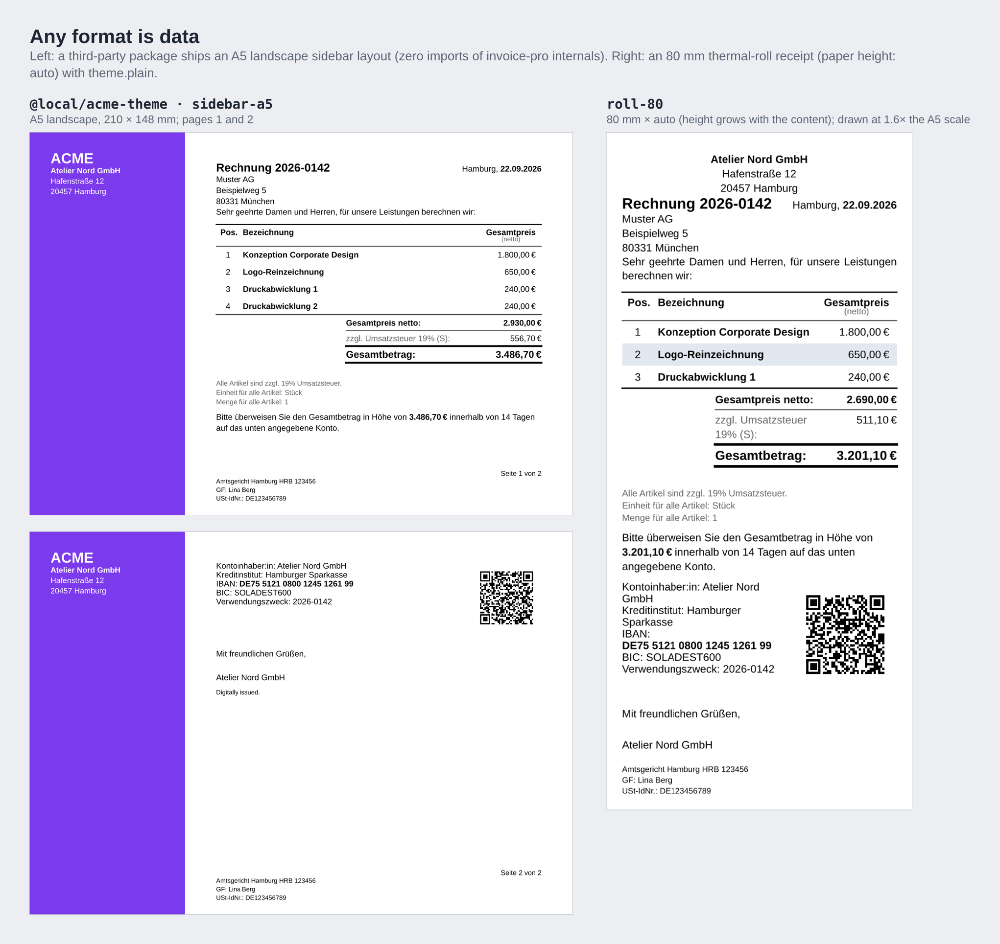

![Figure 2: classic, corporate, prestige, technical and boxed on din-5008-a, sn-010130-right, us-letter-10 and a4-digital, identical data. Every look compiles on every layout because looks patch only look-safe fields of standard area names. The serif letterhead keeps the sender name on one line in the narrow SN box (tighter tracking, then down to 72 % size) and never squeezes the logo plate. Explicit window layouts are not covered by the one-page guarantee: `corporate` on `us-letter-10` continues on a second page (O8).](figures/fig-matrix.png)

---

## 7. Validation levels

### 7.1 The levels

The level is an `invoice()` parameter, not a theme setting: the theme decides what counts as a problem, the document decides what happens with it.

| Level               | Output                                                                                                                                                                                                 | Use for                              |
| ------------------- | ------------------------------------------------------------------------------------------------------------------------------------------------------------------------------------------------------ | ------------------------------------ |
| `"draft"` (default) | renders; inline markers, a badge and a watermark on every page, and a report page; the XML is withheld while a data or e-invoice issue is open. A complete document renders exactly as under `strict`. | writing, previews                    |
| `"strict"`          | the compilation stops and lists every problem: one issue keeps its message verbatim, several get a header and a numbered list                                                                          | sending, CI, batch pipelines         |
| `none`              | no checks; renders what it was given. **Off means off:** with `zugferd` set, the XML is attached even when required data is missing                                                                    | thumbnails, tests; never for sending |

`--input invoice-pro-validation=strict|draft|none` overrides the parameter in both directions, so a pipeline can enforce `strict` without editing documents. An invalid value panics, and common synonyms get a pointed hint (`visual`, `warn` → `"draft"`; `panic`, `error` → `"strict"`; `off`, `false` → `none`). **Misuse always panics**, at every level: unknown keys, wrong types, derivation cycles, unknown parts, undefined geometry, malformed envelopes, an unknown document kind. No output could honour such input. `theme.resolve(..)` defaults to `validation: "strict"`, so a package CI fails on a non-compliant theme.

### 7.2 Issue classes

Every check that follows the level produces one record `(id, class, message, ref, fix, field, key, args)` (`prototype/src/validation/issue.typ`). `message` is the English developer text (the strict panic); `key` and `args` let the report print the problem in the document's language.

| Class       | What                                                               | Examples (ids)                                                                                                                                                                           | Blocks the XML in draft |
| ----------- | ------------------------------------------------------------------ | ---------------------------------------------------------------------------------------------------------------------------------------------------------------------------------------- | ----------------------- |
| `data`      | a legally required document field is missing (§ 14 UStG, EN 16931) | `invoice-number`, `sender-name`, `sender-address`, `sender-tax-id`, `recipient-name`, `recipient-address`, `line-items`, `recipient-vat-id` (reverse charge), `iban`                     | yes                     |
| `e-invoice` | data the selected ZUGFeRD/Factur-X profile requires is missing     | `e-invoice/buyer-address`, `seller-address`, `buyer-reference`, `seller-contact-*`                                                                                                       | yes                     |
| `theme`     | the theme cannot carry required output                             | `theme/role-*`, `theme/part-*`, `theme/empty-*`, `theme/identity-number`, `theme/identity-date`                                                                                          | no                      |
| `lint`      | a quality or export guard                                          | `lint/contrast-*`, `lint/footer-fit`, `lint/overprint-*`, `lint/window-*`, `lint/envelope-*`, `lint/qr-bill-paper`, `lint/fine-size`, `lint/logo-alt`, `lint/pdf-image-*`, `lint/cmyk-*` | no                      |

The data rows are keyed by document kind like the theme requirements (0.5.0: 8 invoice rows plus the IBAN check). Each row cites the German provision and the EN 16931 business term; for AT, CH, FR, IT and ES the national law is cited generically and needs a legal review. Checks read the normalised parties, so every input spelling is covered. The e-invoice checks moved out of the XML builder, which no longer panics. With `en16931` between German parties, messages say "profile 'en16931' applied as 'xrechnung'".

### 7.3 What a draft shows

All feedback is core-owned and brand-immune: fixed rose colours with a contrast of at least 6.6:1. Every open issue is emitted once as labelled metadata, and the badge, the marker numbers and the report all query that one source, so render-time findings (footer fit, identity, empty parts) count like the ones known up front.

- **Inline markers** such as ‹fehlt: Rechnungsnummer›¹ replace the missing field in the frame view. They are real text (assistive technology and text extraction read them) and carry the issue number. In the flow they link to the report row; in page furniture they do not, because PDF/UA-1 forbids links in artifacts.
- **Badge and watermark** on every invoice page: "ENTWURF · 2 Probleme · keine E-Rechnung".
- **Report page** ("Prüfbericht") after the invoice, excluded from the page count, with a bookmarked heading and a real table header: number, class, problem, legal basis and fix per row, plus a callout when the XML was withheld.
- **Keywords**: "Draft" is added; "ZUGFeRD, Factur-X" are dropped when the XML is withheld.

The strings live in a new locale group `strings.validation` (de, en, fr, it, es, base). The report is fully localised: data issues use `fields` and `missing`, and every theme and lint issue (and the invalid IBAN) carries a `key` and `args` that select a text from `strings.validation.issues` (16 keys: contrast, footer fit, identity, roles, envelopes, fine size, logo alt text, CMYK, PDF images and others); role issues also name the localised `strings.validation.roles`. A key a locale lacks falls back to the English message. CI renders a real draft with IBAN, logo, fine-size and contrast problems in all five languages. The draft report compiles under `ua-1` and `a-3b`.

<!-- doc-test: validation -->

```typst
// draft (the default): the invoice renders, the gaps are marked, a report page follows
#show: invoice.with(
  locale: locale.de-de,
  ..party,
  invoice-nr: none, // missing: ‹fehlt: Rechnungsnummer›
  recipient: (name: "Muster AG"), // no address
  zugferd: "basic", // withheld while data is missing
  validation: "draft", // "strict" stops the build; none checks nothing
)
#body()
```

Under `--input invoice-pro-validation=strict` the same file stops with:

```text
invoice-pro found 2 problems (validation: "strict"; preview them with validation: "draft" or --input invoice-pro-validation=draft):
  1. invoice::invoice-nr is missing; every invoice needs a unique, sequential number (§ 14 Abs. 4 Nr. 4 UStG; EN 16931 BT-1)
  2. invoice::recipient has no address (`address`, `city`); the recipient's full address is required (§ 14 Abs. 4 Nr. 1 UStG; EN 16931 BG-8)
```

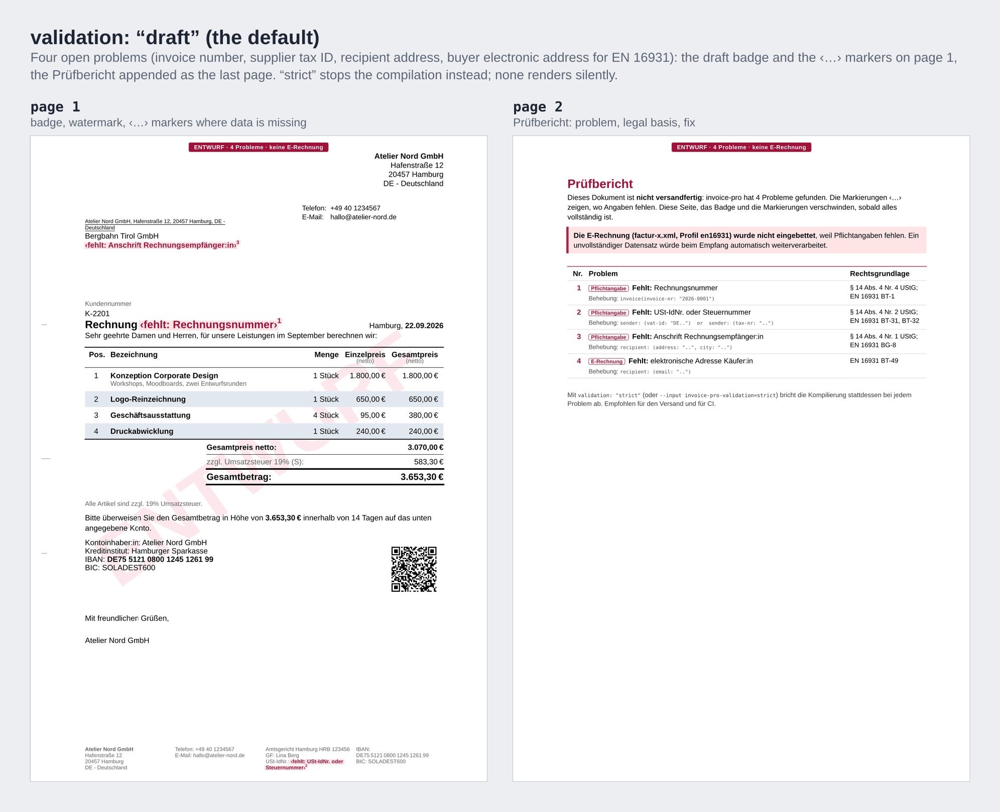

---

## 8. Country layouts & envelope verification

### 8.1 Layouts

| Layout                              | Paper     | Window                       | Envelopes (declared)                                      | Tier         | Default of                      |
| ----------------------------------- | --------- | ---------------------------- | --------------------------------------------------------- | ------------ | ------------------------------- |
| `din-5008-a`                        | A4        | left, DIN zone               | DIN DL, C6/5, C5 form A, C4 form A                        | stable       | DE and unknown regions          |
| `din-5008-b`                        | A4        | left, DIN zone               | DIN DL, C6/5, C5 form B                                   | stable       | AT; `elegant` where A is picked |
| `a4-window-right`                   | A4        | right                        | FR DL + C5, IT 11×23, ES americano (2 positions)          | experimental | FR, IT, ES                      |
| `a4-window-left`                    | A4        | left, no return-address zone | UK DL (BS 4264), DL variant, C5                           | experimental | GB                              |
| `us-letter-10`                      | Letter    | left, #10                    | US #10                                                    | experimental | US                              |
| `sn-010130-right`, `sn-010130-left` | A4        | right / left                 | CH C5/6, C5 (right); C5/6 DIN position, C5, DIN DL (left) | experimental | CH (right)                      |
| `a4-digital`, `us-letter-digital`   | A4/Letter | none                         | –                                                         | stable       | bold, technical, soft           |
| `plain`                             | region    | none                         | –                                                         | stable       | plain                           |
| `a4-sidebar`, `us-letter-sidebar`   | A4/Letter | none; 56 mm brand rail       | –                                                         | experimental | corporate                       |
| `a4-band`, `us-letter-band`         | A4/Letter | none; 40 mm full-bleed band  | –                                                         | experimental | prestige                        |
| `a4-dense`, `us-letter-dense`       | A4/Letter | none; one header row         | –                                                         | experimental | compact                         |

**Swiss layouts and the QR-bill zone.** `sn-010130-right` and `sn-010130-left` reserve **no** QR-bill zone and print no placeholder, so a Swiss sender with the default theme gets a normal one-page invoice. The zone is an explicit opt-in, `theme.layout.reserve-qr-bill(layout)` (0.5.x preview): it adds the 210 × 105 mm `qr-bill` area at the bottom edge of the last page, moves the footer above it and, until the QR-bill component ships, draws a placeholder slip that may need a page of its own (P3). The folds stay at 99/192 mm, so a slip added later is never folded through.

**Dense layouts.** `a4-dense` and `us-letter-dense` arrange recipient, references and title in one header row with an arrange function: a compact title (a stack, like `compact`'s, at most 40 % of the row) keeps the third column; a title that fills its line (a row with number and date, a banner) moves above the row and takes the full width. The serif looks render a title that shares a row compact and right-aligned. Every preset renders cleanly on both dense layouts (20 checks).

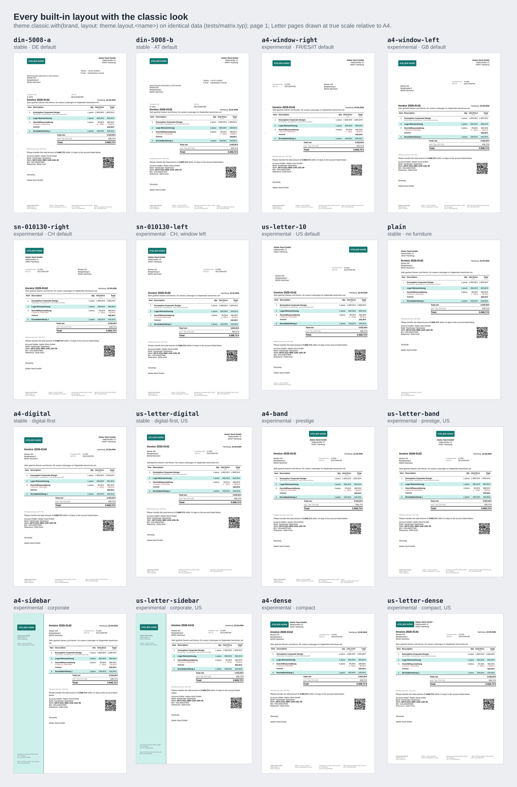

### 8.2 Method and results

A folded sheet moves inside its envelope, and Royal Mail and USPS test by tapping the letter on all four edges. A recipient box is only safe inside the part of the sheet that shows through the window **in every position**. The model (`prototype/src/theming/proof.typ`):

1. The sheet is folded at `fold` (auto = `marks.fold`); the address panel is `[0, first fold]`, and the packet is as tall as the tallest panel.
2. The packet may sit anywhere inside the envelope. Outer envelope sizes are used, which overstates the play, so the check errs on the safe side.
3. The **band** is the window area the sheet shows in every position, minus 2 mm clearance.
4. `prototype/tests/envelopes.typ` asserts, for every declared envelope, at least 5 recipient lines (US: 4) of at least 60 mm, with measured line metrics (first line 3.17 mm, pitch 4.37 mm at 10 pt).

| Layout            | Folds (mm)    | Envelope → lines in the band (line width)                                            | Confidence                                           |
| ----------------- | ------------- | ------------------------------------------------------------------------------------ | ---------------------------------------------------- |
| `din-5008-a`      | 87 / 192      | DL 6 (73 mm), C6/5 6 (64), C5-A 5 (64), C4-A 5 (64)                                  | high (DIN 680 via DIN 5008 literature); C5/C4 medium |
| `din-5008-b`      | 105 / 210     | DL 6 (73), C6/5 6 (64), C5-B 5 (64)                                                  | high; C5 medium                                      |
| `sn-010130-right` | 99 / 192      | C5/6 right 5 (76), C5 right 5 (76)                                                   | medium (Elco, INKA; SN 010130 paywalled)             |
| `sn-010130-left`  | 99 / 192      | C5/6 left, DIN position 6 (67), C5 left 6 (70), DIN DL 6 (70)                        | medium                                               |
| `a4-window-right` | 105 / 210     | FR DL 5 (70), FR C5 5 (70), IT 11×23 5 (70), ES americano 5 (70), ES at 25/25 5 (67) | medium (GPV, Antalis, Arpon); IT low (Blasetti)      |
| `a4-window-left`  | 105 / 210     | UK DL 5 (71), DL variant 5 (71), C5 5 (65)                                           | medium (BS 4264 via literature, Royal Mail)          |
| `us-letter-10`    | 3⅞ in / 7½ in | #10 4 (83.7)                                                                         | medium; the fold is derived                          |

Findings that changed geometry:

- **Swiss second fold at 192 mm.** That fold is the QR-bill perforation line; a fold at 210 mm would cross the Swiss QR code.
- **US #10.** Equal thirds leave 0.46 in of play and only 3 lines survive the tap test. A 3⅞ in top panel leaves ¼ in and 4 lines. Folding machines default to equal thirds, so a test print is recommended.
- **DIN recipient position.** The recipient now sits at the top of its zone, 17.7 mm into the address field; the return address reserves 5 pt below its underline.

The catalogue `theme.layout.envelope` holds 21 records with their sources in `note`. A record is `(name:, size: (w, h), window: (left|right:, top|bottom:, width:, height:), fold: auto | array, note:)`; window anchors are measured on the envelope front with the flap edge up. `theme.layout.folded(folds, ..envs)` pins a fold scheme, so the fit stays right when `marks(none)` removes the printed marks. A folded sheet that does not fit a declared envelope is `lint/envelope-<name>`. Malformed records, a non-array `envelopes`, envelopes on roll paper and unknown proof names are misuse.

### 8.3 `proof()` and `envelopes()`

`theme.custom.proof(true)` (or an array of envelope names) draws, on every invoice page, each envelope window in both extreme positions, the band that always shows, the fold and punch lines, the recipient box and a legend. Print one sheet and hold it against the real envelope. It is meant for a test print, never for production; tie it to an input:

<!-- doc-test: proof -->

```typst
// print one sheet with --input proof=1 and hold it against the envelope
#show: invoice.with(locale: locale.de-de, ..party, theme: theme.classic.with({
  import theme.custom: *
  envelopes(theme.layout.envelope.din-dl, (
    name: "ours-c6-5",
    size: (229mm, 114mm),
    fold: (87mm, 192mm),
    window: (left: 22mm, bottom: 16mm, width: 90mm, height: 45mm),
  ))
  proof(sys.inputs.at("proof", default: "") == "1")
}))
#body()
```


### 8.4 Layout by region

`layout: auto` (the default) lets the preset pick its page master from `env.region`, the sender's country. An explicit `layout:` always wins.

| Function                                        | Returns                                                                                                                                                              |
| ----------------------------------------------- | -------------------------------------------------------------------------------------------------------------------------------------------------------------------- |
| `for-region(region, default: din-5008-a)`       | de → `din-5008-a`, at → `din-5008-b`, ch → `sn-010130-right`, fr/it/es → `a4-window-right`, gb/uk → `a4-window-left`, us → `us-letter-10`; anything else → `default` |
| `paper-for-region(region)`                      | `"us-letter"` for us, else `"a4"` (`letter-regions = ("us",)`)                                                                                                       |
| `digital-for-region(region)`                    | `us-letter-digital` on Letter, else `a4-digital`                                                                                                                     |
| `plain-for-region(region)`                      | `plain` on the region's paper                                                                                                                                        |
| `sidebar-`, `band-`, `dense-for-region(region)` | the corporate, prestige and compact layouts on the region's paper                                                                                                    |

Input may be any case, `none` or not a string. The preset resolvers are listed in §9. `prototype/tests/layout-region.typ` renders all 10 presets for de, at, ch, fr, it, es, gb, us and nl and reports which layout was used.

<!-- doc-test: region -->

```typst
// layout: auto (the default) follows the SENDER's country: AT -> din-5008-b
#let vienna = (address: "Kärntner Ring 5", city: "1010 Wien", country: "AT")
#show: invoice.with(
  locale: locale.de-at,
  ..party,
  sender: party.sender + vienna,
  theme: theme.classic, // pin one: theme.classic.with(layout: ..)
)
#body()
```

---

## 9. Preset catalogue

Ten presets ship. Each is a look (`prototype/src/theming/looks/<name>.typ`) on a default layout resolver. The looks use only public mechanisms (tokens, options, look-safe area fields, part renderers) and share one internal kit (`looks/kit.typ`: value voices, label grids, totals rows, bank rows, the QR block). `elegant` and `prestige` are one serif family (`looks/serif.typ`): shared parts, two colourings. Every preset is CI-checked on 17 layouts (16 plus `auto`), for 9 sender regions, at contrast 4.5 with three seed colours, under PDF/A-3b with ZUGFeRD and under PDF/UA-1 with an image logo, for a one-page 4-item invoice on its default layout, for a one-page 4-item invoice in each of 8 sender regions (`layout: auto`: de, at, ch, fr, it, es, gb, us), and in a widow sweep.

| Preset      | Audience                                         | Idea                                                                                                                              | Default layout (DE / US)                            | Tier         |
| ----------- | ------------------------------------------------ | --------------------------------------------------------------------------------------------------------------------------------- | --------------------------------------------------- | ------------ |
| `classic`   | everyone; the default                            | today's look, more professional (legal footer, continuation header, page 1 of n)                                                  | by region: `din-5008-a` / `us-letter-10`            | frozen       |
| `plain`     | successor of `blank`                             | classic look without furniture; sender, title and recipient in the flow, registration in the footer                               | `plain` on A4 / Letter                              | frozen       |
| `corporate` | larger companies, PO-driven B2B, shared services | two-colour system (navy, brass rules only); brand rail with all legal data, filled table header, payable bar, serif display title | `a4-sidebar` / `us-letter-sidebar`                  | experimental |
| `elegant`   | law firms, notaries, tax advisers, consultancies | a letter from chambers: Libertinus Serif, centred letterhead, ink blue, hairlines, no fills                                       | `din-5008-b` (form B instead of A) / `us-letter-10` | experimental |
| `prestige`  | premium brands, hotels, fashion, fine dining     | onyx full-bleed band with champagne type; champagne returns only as rules; Didone display, Garamond body; digital-first           | `a4-band` / `us-letter-band`                        | experimental |
| `bold`      | agencies and studios                             | poster block in the brand colour with the document word and the amount due; mono labels, heavy rules, payable bar                 | `a4-digital` / `us-letter-digital`                  | experimental |
| `technical` | IT freelancers, software houses, engineering     | spec sheet: mono labels and figures, fine rule grid, `// SECTION` markers, inverted payable amount                                | `a4-digital` / `us-letter-digital`                  | experimental |
| `soft`      | cafés, practices, small retail, B2C              | serif headings, rounded cards, number and date in pills, dotted rules, a "how to pay" card                                        | `a4-digital` / `us-letter-digital`                  | experimental |
| `compact`   | wholesale, distribution, 40–80 line invoices     | 8.5 pt, item-number and unit columns, filled repeating header, delivery-note groups, boxed totals                                 | `a4-dense` / `us-letter-dense`                      | experimental |
| `boxed`     | trades and crafts, print and fax                 | print-first ruled form boxes, heavy grotesque title, mono form labels; no fill carries meaning                                    | by region: `din-5008-a` / `us-letter-10`            | experimental |

Any preset takes the same patches. On identical data the looks stay distinct (`prototype/tests/presets-set.typ` asserts that all looks resolve to different tokens and options):

<!-- doc-test: presets -->

```typst
#let pick = sys.inputs.at("preset", default: "elegant") // any of the ten presets
#let brand = theme.custom.brand(
  color: rgb("#0f766e"),
  logo: image("logo.svg", alt: "Atelier Nord"),
)
#show: invoice.with(
  locale: locale.de-de,
  ..party,
  theme: dictionary(theme).at(pick).with(brand),
)
#body()
```

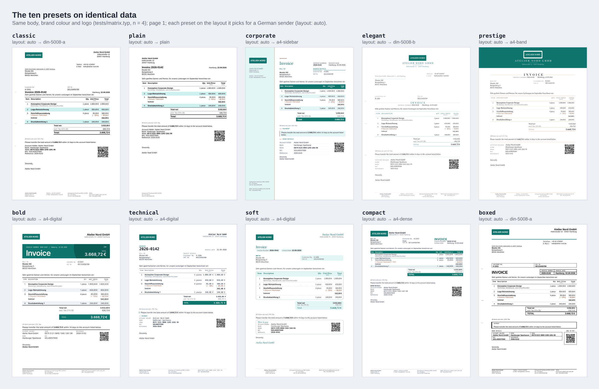

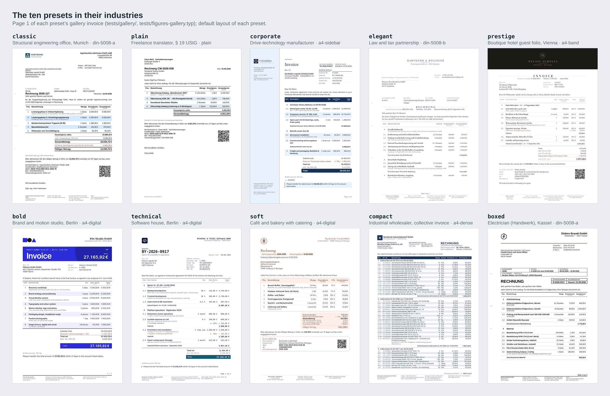

**classic.** The frozen default, with the Q9 drift: computed footer margin, "Page 1 of 2" on page 1, the continuation line "sender · Invoice", a "Reference:" line and a grouped IBAN.

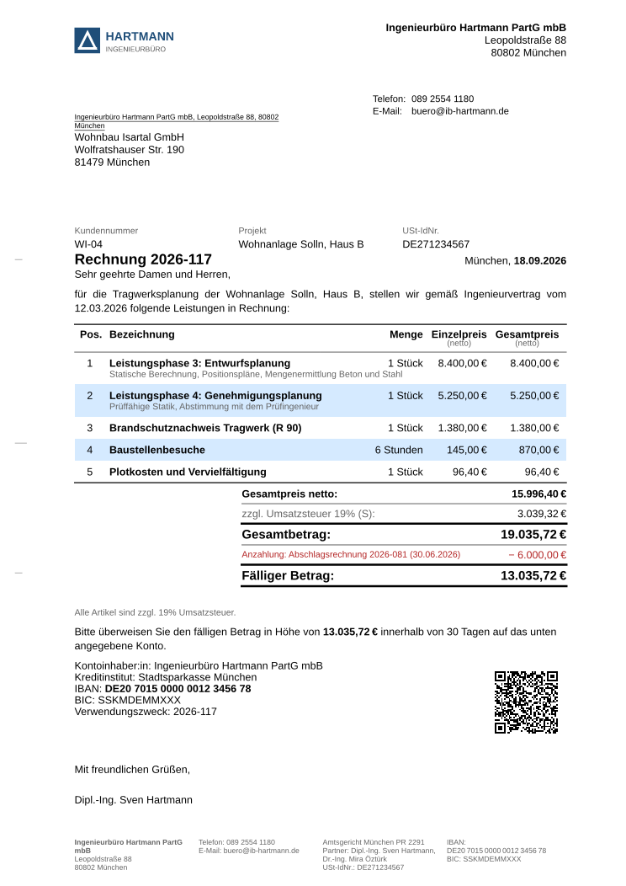

**plain.** Classic without furniture, for own letterheads or flow-only output.

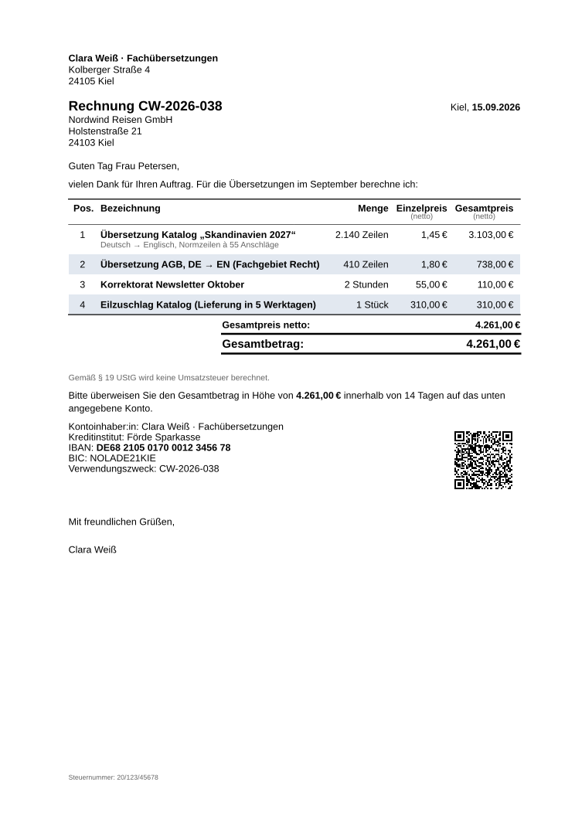

**corporate.** Replaces `modern`. On its sidebar layout the supplier identity and all legal data live in a tinted rail, so the main column holds only what the customer acts on. Gallery: a drive-technology manufacturer invoicing a logistics holding (English, purchase order, volume rebate).

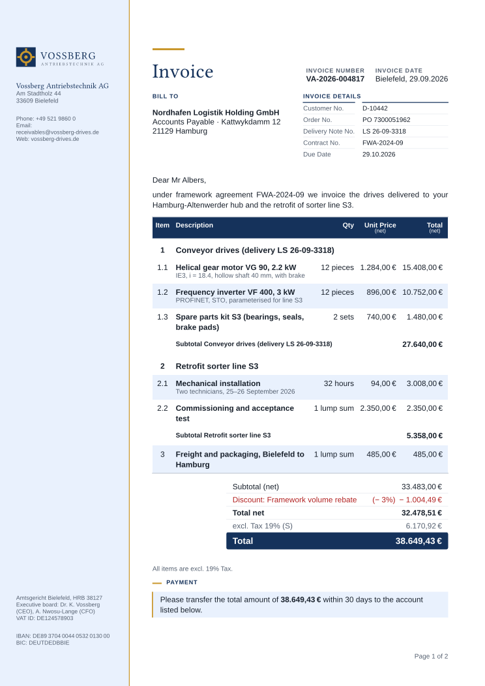

**elegant.** Hierarchy from typography alone: spaced small capitals, the document word between hairlines, the payable amount above the accountant's double rule. It uses DIN form B where the region rule gives form A (the centred letterhead needs the taller zone). Gallery: a law and tax partnership with hourly fees.

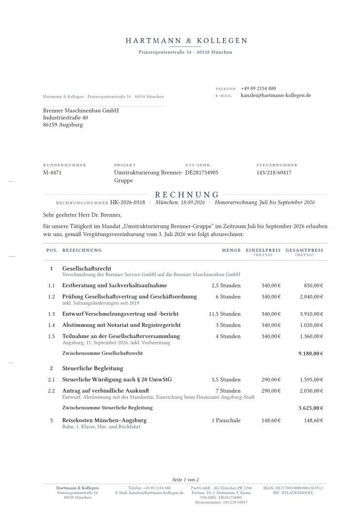

**prestige.** The serif family in onyx and champagne; accent-coloured text uses `colors.accent-text`, a bronze that reaches 4.5:1. Office printers cannot print the band edge to edge, so for print pass a window layout. Gallery: a Vienna hotel's guest folio with split VAT and a deposit. The figures were rendered without EB Garamond, Playfair Display and Bodoni Moda installed, so they show the embedded Libertinus Serif fallback, as the font rule intends.

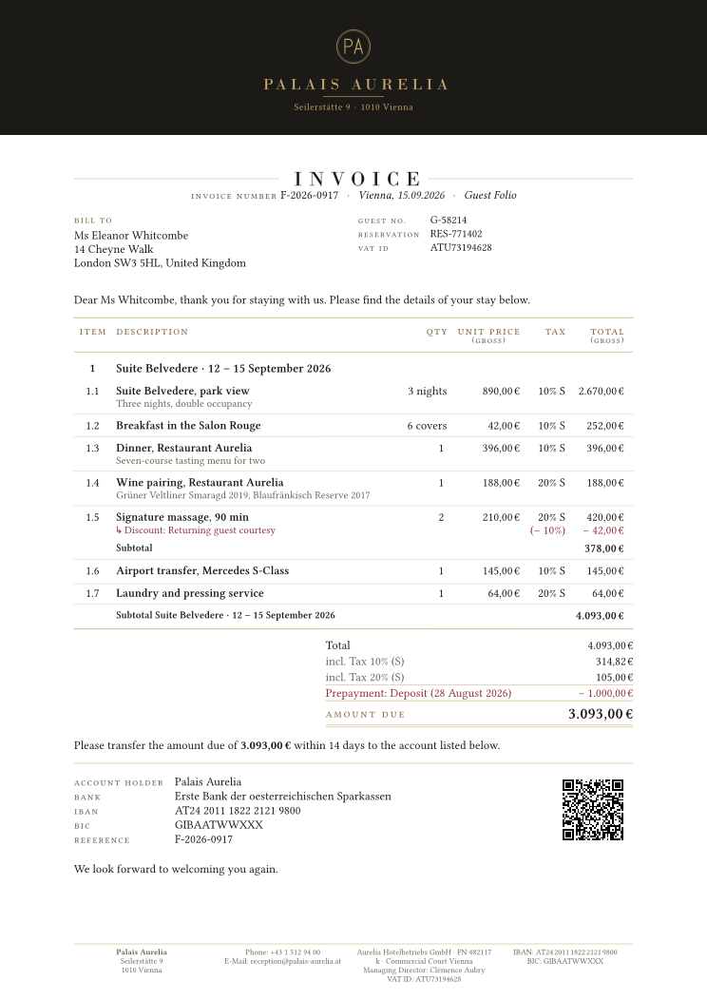

**bold.** All colours derive from one seed; a light brand colour flips the block text to black. Gallery: a Berlin motion studio (English, 8 items, a package discount).

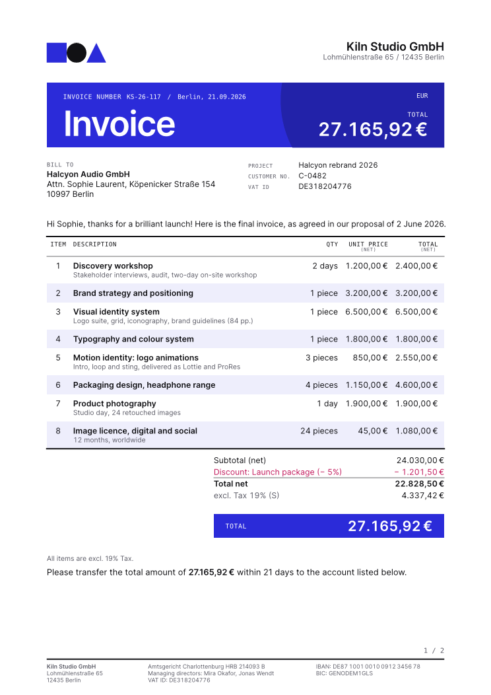

**technical.** DejaVu Sans Mono (embedded) for every figure and label, so it renders identically everywhere. Gallery: a software house (English, groups, surcharge and discount).

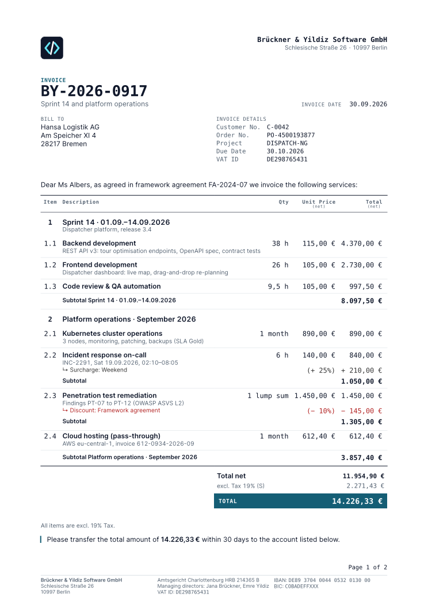

**soft.** For private customers: what, how much and how to pay at a glance. Envelope windows stay plain. Gallery: a café and bakery with catering (gross prices, two VAT rates, a deposit).

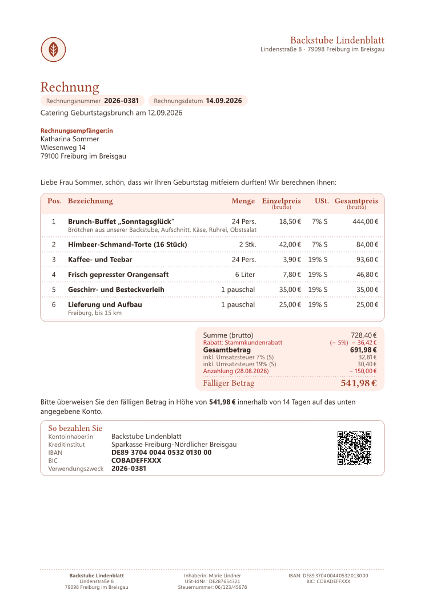

**compact.** 80 items fit on two pages of `a4-dense` (measured on the final tree; the design study counted 58 rows on page 1); delivery-note groups are level-2 table headers kept with their first row. Gallery: a wholesaler's collective invoice over three delivery notes with seller item numbers (SellerAssignedID in the XML).

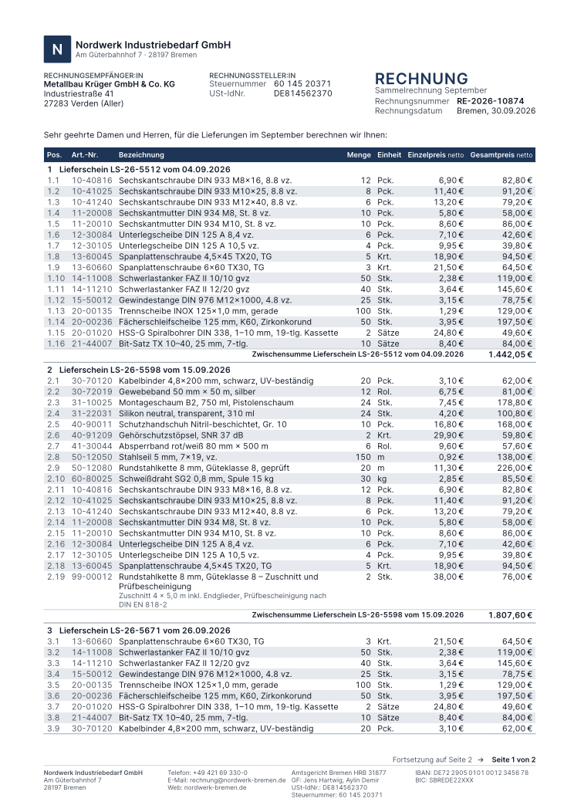

**boxed.** Reads like a work order: the order data sits in a ruled form under the address, and a black-and-white copy loses nothing. Gallery: an electrician's invoice with a down payment and the § 35a EStG labour note.

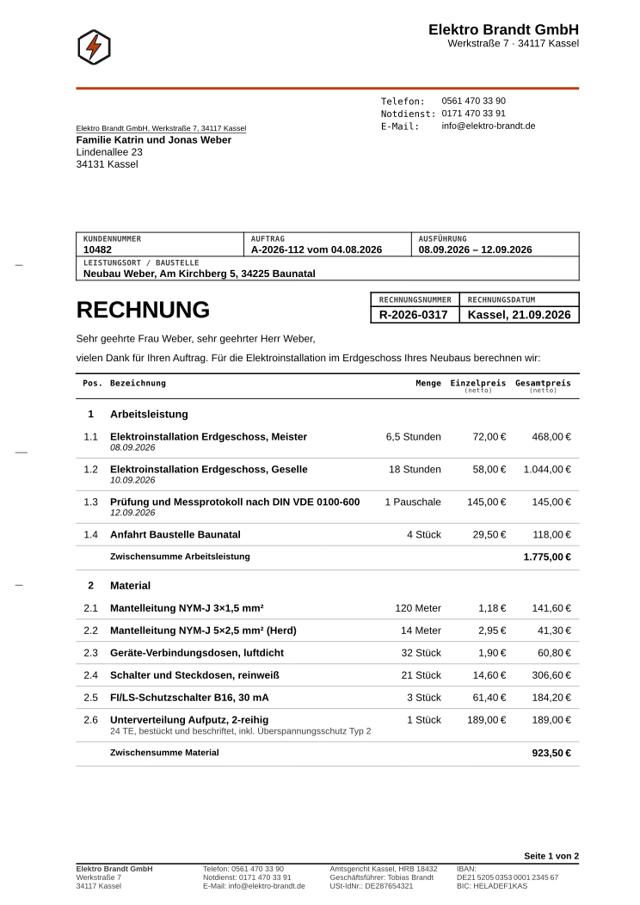

`minimal` stays a docs recipe (`prototype/tests/looks.typ`): no rules, no fills, one colour.

---

## 10. Walkthroughs

Every snippet below is compiled verbatim by `prototype/tests/doc/<name>.typ`. The package block of (9) is `prototype/tests/pkgs/local/acme-theme/0.1.0/lib.typ` and the TOML block is `prototype/tests/doc/nordlicht.toml`. Font chains end in an embedded family, so the snippets render the same everywhere.

**P1: Freelancer, digital only, five minutes** (`p1`). The zebra, the header text and the on-primary colour all re-derive from the one colour.

<!-- doc-test: p1 -->

```typst
#show: invoice.with(
  theme: theme.classic.with(
    theme.custom.brand(
      color: rgb("#0f766e"),
      font: ("Inter", "Liberation Sans", "Libertinus Serif"),
      logo: image("logo.svg", alt: "Studio Lina Berg"),
    ),
    theme.custom.marks(none),
  ),
  locale: locale.de-de,
  tax-exempt-small-biz: true,
  ..party,
)
#body()
```

**P2: GmbH, pre-printed paper + digital twin + ZUGFeRD** (`p2 --input output=print|pdf|einvoice`, Figure 8). One input value selects the mode. In `pdf` mode the rest-page art has its own header, so the continuation header is removed. `einvoice` also compiles under `--pdf-standard a-3b`.

<!-- doc-test: p2 -->

```typst
#let mode = sys.inputs.at("output", default: "pdf") // print | pdf | einvoice
#let acme = theme.custom.brand(
  color: rgb("#003a70"),
  accent: rgb("#e2001a"),
  font: ("Source Sans 3", "Liberation Sans", "Libertinus Serif"),
  logo: image("acme.svg", alt: "ACME Maschinenbau GmbH"),
)
#show: invoice.with(
  theme: theme.classic.with(acme, layout: theme.layout.din-5008-b, {
    import theme.custom: *
    if mode == "print" { stationery("pre-printed") }
    if mode == "pdf" {
      stationery((first: image("lh-1.svg"), rest: image("lh-2.svg")))
      area("continuation", none) // the rest-page art carries its own header
    }
    if mode != "print" { marks(none) }
  }),
  locale: locale.de-de,
  ..party,
  zugferd: if mode == "einvoice" { "basic" },
)
#body(n: int(sys.inputs.at("n", default: "4")))
```

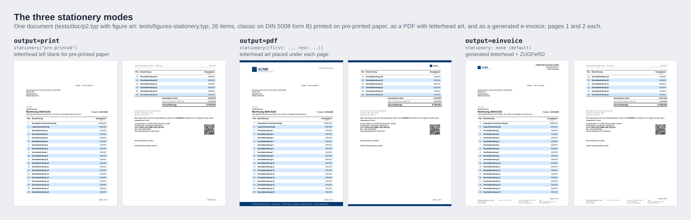

**P3: Swiss SME, right or left window** (`p3`). A Swiss sender gets `sn-010130-right` from `layout: auto`; it is named explicitly here because the QR-bill zone is opt-in: `--input qr-bill=1` wraps the layout in `theme.layout.reserve-qr-bill(..)` (a **0.5.x preview**), which reserves the zone at the bottom of the last page and relocates the footer above it; the slip itself is a placeholder until the QR-bill component exists (O1). Switching the window side is two anchor patches, because setting `left` clears `right`.

<!-- doc-test: p3 -->

```typst
#let sn = theme.layout.sn-010130-right // what layout: auto picks for a Swiss sender
#let qr-bill = sys.inputs.at("qr-bill", default: "") == "1" // opt-in, 0.5.x preview
#show: invoice.with(locale: locale.de-ch, ..party, theme: theme.classic.with(
  layout: if qr-bill { theme.layout.reserve-qr-bill(sn) } else { sn },
  {
    import theme.custom: *
    brand(color: rgb("#7a1f2b"), font: ("Source Serif 4", "Libertinus Serif"))
    if sys.inputs.at("window", default: "right") == "left" {
      area("address", left: 22mm) // setting left clears right
      area("info", right: 18mm) // setting right clears left
    }
  },
))
#body(n: int(sys.inputs.at("n", default: "4")))
```

**P4: Agency, white-label brands in TOML** (`p4`, `prototype/tests/doc/nordlicht.toml`). In a data file, `"auto"` resets a value, `"none"` switches it off, and lengths and hex colours are coerced. A key typo fails with ``theme::tokens::colors has unknown key `primry`. Did you mean `primary`? ...``.

<!-- doc-test: nordlicht.toml -->

```toml
[theme.tokens.colors]
primary = "#0b3d91"
accent = "#ffb000"
[theme.tokens.fonts]
body = ["Libertinus Serif"]
[theme.options.logo]
image = "logo.svg"
height = "9mm"
[theme.options.items-table]
zebra = ["none", "none"]
header-text = "auto"
[theme.layout]
margin = { bottom = "35mm" }

[sender]
name = "Nordlicht Studio"
address = "Kai 1"
city = "24103 Kiel"
```

<!-- doc-test: p4 -->

```typst
#let e = toml("nordlicht.toml")
#show: invoice.with(
  theme: theme.corporate.with(theme.custom.from-data(
    e.theme,
    assets: p => image(p, alt: e.sender.name),
  )),
  locale: locale.de-de,
  ..party,
  sender: party.sender + e.sender,
)
#body()
```

**P5: SaaS batch pipeline** (`p5`). The theme is an immutable value that is built once. The pipeline runs with `--input invoice-pro-validation=strict`, so an incomplete invoice fails the job instead of rendering a draft; `theme.resolve(company)` goes into its unit tests. The layout is explicit here because the job file names the region: `theme.layout.digital-for-region` returns `us-letter-digital` for us and `a4-digital` otherwise (`layout: auto` would follow the sender's country and give `classic` its window layout).

<!-- doc-test: p5 -->

```typst
// theme.typ of the pipeline: built once, an immutable value imported everywhere
#let company = theme.classic.with(
  theme.custom.from-data(json("brand.json")),
  theme.custom.checks(min-contrast: 4.5),
)
#let locales = (de-de: locale.de-de, en-de: locale.en-de) // explicit map, no reflection
#let d = json("job.json")
#show: invoice.with(
  theme: company.with(layout: theme.layout.digital-for-region(d.region)),
  locale: locales.at(d.locale),
  ..party,
)
#body()
```

**P6: Design studio: corporate on DIN B, wrap + replace** (`p6`). The called form is equivalent to `.with`; `ctx.locale` is part of the contract.

<!-- doc-test: p6 -->

```typst
#show: invoice.with(locale: locale.de-de, ..party, theme: theme.corporate(
  layout: theme.layout.din-5008-b,
  {
    import theme.custom: *
    brand(
      color: rgb("#111827"),
      accent: rgb("#6366f1"),
      font: ("Inter", "Libertinus Serif"),
      heading-font: ("Fraunces", "Libertinus Serif"),
      logo: image("logo.svg", alt: "Atelier Nord"),
    )
    area("letterhead", parts: ("sender", "logo")) // logo right: data, no renderer
    totals(width: 100%, fill: none)
    wrap("totals", (ctx, view, inner) => block(
      stroke: (left: 3pt + ctx.theme.tokens.colors.accent),
      inset: (left: 6pt),
      inner(ctx, view),
    ))
    part("payment-terms", (ctx, view) => {
      let amount = (ctx.locale.format.currency)(view.total)
      let fill = ctx.theme.tokens.colors.accent.lighten(88%)
      let due = [Fällig in #view.days Tagen: *#amount*]
      block(fill: fill, inset: 1em, text(size: 1.2em, due))
    })
  },
))
#body()
```

**P7: Accessibility-bound supplier** (`p7`, compiles under `--pdf-standard ua-1` on 0.14.2 and 0.15.1). Metadata and `lang` come from core, and a logo `image` without `alt` is `lint/logo-alt`. The recipient and title are tagged in reading order; the furniture, including the legal footer, is made of artifacts (Typst behaviour; O6).

<!-- doc-test: p7 -->

```typst
#let logo = image("sw.svg", alt: "Stadtwerke Musterstadt")
#show: invoice.with(locale: locale.de-de, ..party, theme: theme.classic.with(
  theme.custom.brand(color: rgb("#00843d"), logo: logo),
  theme.custom.checks(min-contrast: 4.5),
  theme.custom.marks(none),
))
#body()
```

**P8: US subsidiary, same brand** (`p8`). `locale.en-de` stands in until a US locale region ships. Footer content cells print at the fine size, and `info.*` motifs work in them.

<!-- doc-test: p8 -->

```typst
#import "corporate.typ": corporate // the same brand patch as in P2
#show: invoice.with(locale: locale.en-de, ..party, theme: theme.classic.with(
  corporate,
  layout: theme.layout.us-letter-10,
  theme.custom.area("footer", arrange: (columns: (1fr, 1fr, 1fr)), parts: (
    [*Remit to:* #info.sender.name, PO Box 12, Austin TX],
    [billing\@acme.com],
    "registration",
  )),
))
#body()
```

**(9) Third-party package author** (`p9` + `prototype/tests/pkgs/local/acme-theme/0.1.0`, Figure 1). The package imports nothing from invoice-pro and lists only the areas it uses. The rail hosts the prefixed decoration part and the built-in `sender` part, which satisfies the supplier role. The bottom margin is computed from its footer.

<!-- doc-test: acme-theme -->

```typst
// @preview/acme-theme - NO invoice-pro import
#let sidebar-a5 = (
  name: "acme-sidebar-a5",
  paper: "a5",
  flipped: true,
  marks: none,
  margin: (top: 12mm, left: 72mm, right: 12mm), // bottom: computed from the footer
  areas: (
    rail: (
      place: "background",
      pages: "all",
      left: 0mm,
      top: 0mm,
      width: 60mm,
      height: 100%,
      stationery: true,
      fill: t => t.colors.primary,
      inset: 8mm,
      text: (fill: t => t.colors.on-primary, size: 8.5pt),
      parts: ("acme/rail", "sender"),
    ),
    title: (place: "before", parts: ("title",)),
    address: (place: "before", parts: ("recipient",)),
    page-number: (place: "footer", parts: ("page-number",), align: right),
    footer: (place: "footer", parts: ("registration",)),
  ),
)
#let rail(ctx, view) = text(size: 16pt, weight: "bold")[ACME]
#let patch = (
  parts: (
    "acme/rail": rail,
    signature: (
      "__invoice-pro-wrap__": (ctx, view, inner) => {
        inner(ctx, view)
        text(size: 7pt)[Digitally issued.]
      },
    ),
  ),
  tokens: (colors: (primary: rgb("#7c3aed")), sizes: (body: 9pt)),
  options: (items-table: (zebra: (none, none)), totals: (width: 60%)),
)
```

<!-- doc-test: p9 -->

```typst
#import "@local/acme-theme:0.1.0" as acme
#show: invoice.with(locale: locale.de-de, ..party, theme: theme.classic.with(
  acme.patch,
  layout: acme.sidebar-a5,
))
#body()
// package CI (against the published invoice-pro):
#let _ = theme.resolve(theme.classic.with(acme.patch, layout: acme.sidebar-a5))
```

**(10) Scoped override** (`p10`, experimental).

<!-- doc-test: p10 -->

```typst
#show: invoice.with(locale: locale.de-de, ..party)
#line-items[
  #group([Phase 1])[#item([Konzeption], price: 1800)]
  #themed(theme.custom.row(fill: rgb("#fef3c7")))[
    #group([Phase 2 (optional)])[
      #item([Reinzeichnung], price: 650)
      #item([Druck], price: 240)
    ]
  ]
]
#themed({
  import theme.custom: *
  colors(primary: rgb("#b91c1c")) // tint re-derives inside the scope
  wrap("bank-details", (ctx, view, inner) => block(
    fill: ctx.theme.tokens.colors.tint,
    inset: 8pt,
    inner(ctx, view),
  ))
})[#bank-details(bank: "Hamburger Sparkasse", iban: "DE75512108001245126199")]
```

**Company geometry** (`layout`): geometry goes into a derived layout, not into patches. The derived layout inherits the declared envelopes, so the fit check covers the new window position.

<!-- doc-test: layout -->

```typst
// A company-specific window: geometry lives in a derived layout, not in patches
#let our-window = theme.layout.derive(theme.layout.din-5008-a, {
  import theme.custom: *
  area("address", left: 24mm, top: 40mm)
  area("info", top: 45mm)
  page(margin: (bottom: 35mm))
})
#show: invoice.with(
  locale: locale.de-de,
  ..party,
  theme: theme.classic.with(layout: our-window),
)
#body()
```

---

## 11. Error messages

The house style is a `theme::` path, the value, the allowed set and a did-you-mean hint. Type errors keep the `types.require` wording, plus "(or a derivation `t => ..`)" where derivations are allowed. The prototype has 41 compile-fail cases, run under `--input invoice-pro-validation=strict`; `prototype/scripts/run-all.sh` compares their messages byte for byte with `prototype/tests/errors/expected.txt`. Of these, 17 follow the level (16 are also rendered under draft and none; case 17's fixture is not a real PDF), and 24 are misuse that panics even under `none`. A selection, verbatim:

```text
theme::tokens::colors has unknown key `primry`. Did you mean `primary`? Allowed keys: primary, on-primary, primary-text, accent, accent-text, text, text-muted, border, tint, background
theme::layout::areas has no area `adress` in layout `din-5008-a`. Did you mean `address`? Existing areas: marks, letterhead, address, info, references, title, continuation, page-number, footer. To ADD an area, give it a `place`.
theme::layout (din-5008-a) must host `recipient` in exactly one first-page (tagged) or flow area (found 0). It carries legally required output: recipient name and address (§ 14 UStG; EN 16931 BG-7). Restyle it by replacing its renderer, but keep it placed.
theme: the invoice number (2026-0142) does not appear in the first-page content; the area hosting `title` must render view.document.number (§ 14 UStG; EN 16931 BT-1)
theme::layout::areas::footer is 42.2mm tall, but the bottom margin leaves 17.4mm between footer-descent and the 5mm footer-clearance; use the computed margin (theme.custom.page(margin: (bottom: reset()))), raise margin.bottom or shorten the footer
theme::layout::envelopes::c6 does not take the folded sheet: packet 210 x 105 mm, envelope 162 x 114 mm; check the paper, `marks.fold` or the envelope's `fold`
theme `classic`: the layout resolver `env => ..` must return a layout dictionary (such as `theme.layout.din-5008-b`), found "din-5008-a"
theme::layout::stationery must be none (the theme draws everything), "pre-printed" or (first: content, rest: content), found "generated"
variable `invoice::validation`("visual") must be one of none, "draft", "strict". Did you mean "draft"?
```

The asset guards are early hints; Typst enforces the real rules (no PDF images under PDF/A or `ua-1`, alt text under `ua-1`, no CMYK under `a-3b`). The alt-text guard runs for every user, because a document cannot see `--pdf-standard`.

---

## 12. Internals sketch

```text
invoice(theme:, validation:)                        src/invoice.typ
  level = resolve-level(validation)                 (--input invoice-pro-validation wins)
  sender normalised -> env = (kind, lang, region = sender country, e-invoice)
  eval = theme(base: schema, env:)                  -> layout resolver, fold, resolve, validate
  issues = eval.issues + check-data("invoice", "input", ..)   (none: skipped)
  inputs.theme = seal(eval); inputs.validation = (level, issues)
root.draw   lang · measured data checks · e-invoice checks · enforce (strict panics)
            pdf.attach(factur-x) unless draft and blocking · set document(keywords) · frame
frame       set page (computed margin) · footer fit · first-page areas (identity tags)
            · body · running areas · proof layer · draft badge, watermark, report
components  call-part(ctx, name, view): required + empty -> marker (draft) / panic (strict)
line-items  view.tail -> items-table binds the totals to the last entry
bank        measure: IBAN check (data issue), EPC payload, QR clamp
themed      scope-theme(theme, patches): light finalize, scoped issues
```

| File (`prototype/src/`)                                | Lines | Role                                                                                                  |
| ------------------------------------------------------ | ----- | ----------------------------------------------------------------------------------------------------- |
| `utils/patch.typ`                                      | 267   | shared merge, did-you-mean, patch flattening                                                          |
| `theming/schema.typ`                                   | 361   | `field()`, token/option/check/area/layout schema, stubs, kinds, part-options                          |
| `theming/resolve.typ`                                  | 241   | sound fixpoint, area derivations, per-leaf types                                                      |
| `theming/layout-ops.typ`                               | 156   | area patching, anchor pairs, stubs, `derive`                                                          |
| `theming/validate.typ`                                 | 743   | requirements, paper sizes, areas, overprint, envelopes, parts, tokens, assets, contrast               |
| `theming/build.typ`                                    | 359   | `build-theme` (internal), resolvers, `finalize`, `scope-theme`, `resolve`, env                        |
| `theming/frame.typ`                                    | 802   | frame view, computed margin (one-page rule), identity, areas, relocation, proof layer, draft feedback |
| `theming/proof.typ`                                    | 379   | envelope records, band, recipient box, window fit, overlay                                            |
| `theming/layouts.typ`                                  | 841   | 16 layouts, 21 envelopes, region functions, `reserve-qr-bill`, the dense arrange                      |
| `theming/parts/*.typ`                                  | 695   | default frame and body parts                                                                          |
| `theming/{custom,data,presets,color,scope,access}.typ` | 630   | DSL, `from-data`, presets, colour maths, `themed`, sealing                                            |
| `theming/looks/*.typ`                                  | 3,127 | kit (344), serif family (506 + 83), 6 further looks                                                   |
| `validation/{issue,data,render}.typ`                   | 496   | issue records (with `key`, `args`) and levels, data rows, markers, badge, watermark, report           |
| **Total**                                              | 9,097 | concept v1: 2,146 (unformatted); the core without looks is 5,970 after typstyle                       |

Outside `prototype/src/theming` the prototype touched `invoice.typ` (validation, env, sender first), `components/root.typ` (measured checks, XML withholding, keywords), `zugferd/build.typ` (checks moved out, no panics), `components/item.typ` and `bundle.typ` (unit plurals), `utils/coercion.typ` (dict item ids), the line-items table renderer (tail binding, header style, row knobs), and the five locales (`strings.validation` including `issues` and `roles`, `sections`, `document.page`, `document.continued-on`, `line-items.item-id` and `unit`, `signature.thanks`, `payment.text-due`). The 0.4 theme files (`themes/DIN-5008`, `blank`, the hidden table variants) are still present and go in step B.

**loom 0.1.1 as-is:** only public API is used. Nice-to-haves: an official opaque ctx value (makes sealing a contract), a deep-merge `apply`, an exported `matcher.display`, a fix for the labelled-container crash, a version-independent motif key, and `ensure` distinguishing missing from `none`.

---

## 13. Feasibility evidence & Typst 0.14 validation

### 13.1 Suite

The prototype is a git repository; the bundled `prototype/` is a clean export of it (no history, logs or renders). `sh scripts/run-all.sh` runs everything and prints one line per check. The counts below are the lines of that output, grouped by area.

| Area                        | Checks  | Verified                                                                                                                                                                                                                                                                                                  |
| --------------------------- | ------- | --------------------------------------------------------------------------------------------------------------------------------------------------------------------------------------------------------------------------------------------------------------------------------------------------------- |
| semantics, coverage, naming | 9       | merge rules, stubs, anchor pairs, derivations, helper == schema both ways; the new names resolve, 5 old names are rejected, misuse case 41 panics under `none`                                                                                                                                            |
| envelopes and proofs        | 8       | every declared envelope fits (§8.2); proof renders for 7 window layouts                                                                                                                                                                                                                                   |
| walkthrough renders         | 10      | walkthrough tests, P2 in three modes and under `a-3b`, the third-party package                                                                                                                                                                                                                            |
| doc snippets                | 19      | every `typst` block of this document, generated from it                                                                                                                                                                                                                                                   |
| error suite                 | 1       | 41 compile-fail cases, messages byte-identical on both compilers                                                                                                                                                                                                                                          |
| validation                  | 45      | draft in 5 languages and 3 looks, none clean, strict/misuse 10 cases byte-identical, 16 follow-level cases render under draft and none, 23 misuse cases panic under none, draft under `a-3b` and `ua-1`, `none` + ZUGFeRD attaches the XML while draft withholds it                                       |
| layout by region            | 29      | classic, corporate, plain × 9 regions; all 10 presets × 9 regions (one check); explicit layout wins                                                                                                                                                                                                       |
| API gaps                    | 70      | computed margin and footer fit, view fields, identity after layout, `checks.pairs`, table knobs, totals rows, tokens, locale strings                                                                                                                                                                      |
| presets                     | 417     | preset set; 10 presets × 17 layouts plus `minimal` × 16 (186 compiles); contrast 4.5 over 3 seeds; `a-3b` + ZUGFeRD and `ua-1` per preset; one-page n=4; galleries; embedded fonts only; widow sweeps                                                                                                     |
| audit                       | 11      | unit plurals, dict item ids, invalid IBAN as a data issue, profile wording                                                                                                                                                                                                                                |
| layout fixes                | 122     | dense header row: 10 presets × `a4-dense`, `us-letter-dense` (20); Swiss layouts: 10 presets × right/left without a QR-bill zone on one page, `layout: auto` for a Swiss sender, the `reserve-qr-bill` opt-in (22); one page for a 4-item invoice: 10 presets × 8 sender regions with `layout: auto` (80) |
| polish                      | 10      | serif letterhead unit test and 64 stress renders, public module exports, the draft report in 5 languages, issue keys in `src` == localised keys (16), doc logo assets                                                                                                                                     |
| token mutation              | 1       | one run of `prototype/scripts/mutation.sh`: each of the 30 frozen tokens changes a render                                                                                                                                                                                                                 |
| **Total**                   | **752** | **752/752 on 0.15.1 (Windows) and 752/752 on 0.14.2 (NixOS, WSL), after typstyle formatting**                                                                                                                                                                                                             |

The layout matrix proves that every look compiles on every layout, not that it looks right: the dense-layout defect of the phase-4 tree passed it. The layout-fix checks therefore assert geometry (no overlap in the dense header row, one page, no QR-bill zone), and the figures were rebuilt and inspected after the fixes. The one-page checks cover `layout: auto`; explicit window layouts are not guaranteed (O8).

### 13.2 Typst 0.14.2 vs 0.15.1

- **No source change for 0.14.** The only difference the suite sees is cosmetic: 0.14 prints panic messages quoted and escaped. `prototype/scripts/panic-text.awk` normalises both forms (and folds multi-line strict panics) for the byte comparison. Users on 0.14 see the quoted form.
- **Exact 0.14.0 was not testable** offline (the nix store has 0.14.2). The 0.14.1 changelog fixes table-header tagging, which can affect PDF/UA-1 of the items table on 0.14.0. Recommend 0.14.2 or newer for PDF/UA; a CI job pinned to 0.14.0 settles it.
- **Visual parity** (compat study on the phase-4a base, pinned fonts, 77 pages): 0.14.2 vs 0.15.1 identical on 71 pages; the other 6 differ in 8 pixels by at most 2/255 of anti-aliasing. No baseline or line-height shift, same page counts. Not re-run on the final tree (the pinned fonts are not in the repository).

### 13.3 PDF standards (`prototype/scripts/pdf-standards.sh`, 13/13 on both compilers)

| Export                                               | 0.14.2                                                      | 0.15.1     |
| ---------------------------------------------------- | ----------------------------------------------------------- | ---------- |
| `ua-1` (classic, corporate, plain, minimal)          | ok                                                          | ok         |
| `a-3b` + ZUGFeRD basic and en16931 (same 4)          | ok; factur-x.xml attached (AFRelationship Alternative, CII) | ok         |
| `a-3a,ua-1` in one file                              | rejected ("only one PDF substandard at a time")             | accepted   |
| per preset: `a-3b` + ZUGFeRD, `ua-1` with image logo | 10 + 10 ok                                                  | 10 + 10 ok |
| draft report under `a-3b` and `ua-1`                 | ok                                                          | ok         |

### 13.4 Performance

Median of 5 runs, pinned fonts, full PDF compile of the final tree (`prototype/scripts/bench.sh`, one laptop, not idle; absolute times vary by about ±30 %).

| Items | 0.4.2 (0.15.1) | sealed (0.15.1)  | unsealed (0.15.1) | 0.4.2 (0.14.2) | sealed (0.14.2)   | unsealed (0.14.2) |
| ----- | -------------- | ---------------- | ----------------- | -------------- | ----------------- | ----------------- |
| 1     | 427 ms         | 504 ms (+18 %)   | 760 ms            | 217 ms         | 389 ms (+79 %)    | 448 ms            |
| 150   | 1,868 ms       | 2,299 ms (+23 %) | 5,617 ms          | 1,871 ms       | 2,084 ms (+11 %)  | 4,466 ms          |
| 400   | 5,352 ms       | 6,493 ms (+21 %) | 12,959 ms         | 3,992 ms       | 8,514 ms (+113 %) | 13,094 ms         |

Two interleaved re-runs of n = 400 on 0.14.2 (0.4.2 and the prototype alternating, 5 pairs) gave medians of 4,160 ms and 7,232 ms (+74 %, not logged) and, on an idle machine, 2,632 ms and 3,831 ms (+46 %). The 400-item overhead on 0.14.2 is therefore somewhere between +46 and +113 % and sensitive to machine load; on the phase-4a base the compat study had measured +31 to +39 %, so the phase-4b additions cost time on 0.14 at high item counts. The extra fixed cost at 1 item is about 170 ms on 0.14.2; a likely cause is that all eight looks are parsed on import. The maintainer accepted a performance cost; profiling the 400-item case on 0.14 is open (O11). Sealing stays essential: without it, compiles take 1.5–2.4× as long (1.15× at 1 item on 0.14.2).

### 13.5 Not verified

- physical test prints with real envelopes (IT 11×23 and the US fold especially);
- SN 010130, NF Z 11-001, ÖNORM A 1080 and BS 4264 themselves (paywalled; geometry from post and manufacturer data);
- whether real designer letterheads converted to SVG pass veraPDF/Mustang;
- the national legal references outside Germany;
- native-speaker review of the new fr/it/es strings;
- Typst 0.14.0 exactly.

---

## 14. Trade-offs, risks & rejected alternatives

**Weaknesses.**

- **Fixed areas are absolute.** Content taller than its rectangle overflows. The window-fit check covers the box geometry, not the rendered address: a 6-line address overflows visibly in the proof but is not an issue yet.
- **More concepts than a knob list.** There are six (issue joins the five). The ladder hides areas until rung 4, and `brand()` covers rung 2.
- **Owning the frame means owning postal correctness.** The country layouts rest on manufacturer data and a derived US fold. They are experimental until test prints confirm them.
- **The Swiss slip is not there yet.** `ch` maps to `sn-010130-right` without a QR-bill zone, so Swiss users print the payment part separately until the QR-bill component ships; `reserve-qr-bill` only previews the zone (O1).
- **Per-page margins are impossible** in Typst, so a tall footer raises the bottom margin on every page.
- **Sealing depends on lazy content hashing.** That is observed behaviour, not a guarantee. If it changes, compiles get slower but the output stays correct.
- **Guards catch accidents, not intent.** A part that returns `[x]` passes.
- **Replacing the table is still expensive.** Looks that restyle the items table replace it and re-derive the v1 view; `bold` needs a show-rule hack for upper-case headers. The table rewrite over view v2 stays 0.5.x or 0.6.
- **The default look changes** (Q9): computed margin, page 1 of n, continuation line, reference line, grouped IBAN, a 0.7em table–totals gap and ragged body text change the committed reference images once.

**Rejected alternatives.**

1. The phase-2 alternatives (190 tokens, a style × layout matrix, 29 knobs, named `tokens:` shorthands), a replaceable frame part, keeping letter-pro, a shim over the old DIN document, elembic and valkyrie: as in v1.
2. Rename aliases for prototype names and provisional options: no code, permanent cost.
3. `from-data` alias strings (`"{colors.primary}"`): a second expression language.
4. Validation as a theme setting, and per-class levels now: the document decides; per-class levels can come later without breaking the string form.
5. Withholding the XML silently under `none`: rejected by the maintainer ("off means off").
6. Layout from the **locale** region: paper and envelopes belong to the sender; an English invoice from Germany still goes in a German envelope.
7. Two widow mechanisms (a table footer, a keep-with wrap): one core rule (`view.tail`) also works for wrapped tables.

---

## 15. Implementation roadmap (solo maintainer)

Typst packages cannot publish `-rc` or `-dev` versions, so the only releases are 0.4.3 and 0.5.0. The steps are branches; the prototype code is the starting point for each.

| Step              | Scope                                                                                                                                                                                          | Days              |
| ----------------- | ---------------------------------------------------------------------------------------------------------------------------------------------------------------------------------------------- | ----------------- |
| **0.4.3**         | `utils/patch.typ` adopted by `locale.custom`/`build-locale` (fixes I-1/I-2/I-3); `lang` fix; `set document` + `pdf.attach` in root; unit plurals and dict item ids; 0.14 CI job                | 4–5               |
| **A** engine      | schema, resolve, build, validate, custom, layout-ops; error suite, coverage, semantics, naming and mutation tests                                                                              | 5–7               |
| **B** own frame   | frame, frame parts, the stable layouts, computed margin, stationery, identity, requirements, `strings.document.page`; remove letter-pro, `themes/DIN-5008`, `blank`, the hidden table variants | 6–8               |
| **C** body        | body parts over the existing renderers, totals row model, `view.tail`, table knobs, `notes` outside the composite, 0 % and EPC in measure, `payment-terms`                                     | 4–5               |
| **D** validation  | levels, issue classes, data rows, e-invoice checks out of the builder, markers, badge, report, `strings.validation` (5 languages)                                                              | 3–4               |
| **E** layouts     | window layouts, envelope catalogue, proof, region functions; one test print per layout family                                                                                                  | 2–3               |
| **F** presets     | looks kit, the eight experimental presets, galleries, contact sheets; `themed`, `from-data`                                                                                                    | 4–6               |
| **G** tests       | `themes.blank` → `theme.plain`; refs regenerated on 0.14 with pinned fonts; one ref per layout and preset; resolve-level matrix; doc snippets                                                  | 2–3               |
| **H** docs & lock | 4 pages (overview; layouts, areas and "write your own format"; parts and packages; validation) + migration table + preset gallery; thumbnail                                                   | 4–5               |
| **0.5.0**         | **API lock**                                                                                                                                                                                   | 34–46 incl. 0.4.3 |

**0.5.x (additive, in rough priority):**

1. the QR-bill component, `view.qr-bill`, `reserve-qr-bill` with a real slip, and the SN layouts as stable (with masks);
2. document kinds as rows (`receipt` first, then `credit-note`, `delivery-note`), plus CH and receipt data rows;
3. the payment envelope;
4. the table/totals rewrite with view v2 (or 0.6), with an upper-case header option;
5. window fit of the rendered address (lint);
6. NF/UK layouts from verified masks; double-window envelopes;
7. `adjust` (tokens and options only), look-level part placement (makes `a4-dense` unnecessary);
8. mono / ink-saving macro (R33), `specimen` (R43), DTCG adapter (R7);
9. page-invariant frame rendering (performance).

---

## Appendix A: Decisions and open questions

### A.1 Decided by the maintainer (2026-09-21)

| #   | Question (concept v1)                            | Decision                                                                                            | Where    |
| --- | ------------------------------------------------ | --------------------------------------------------------------------------------------------------- | -------- |
| Q1  | Singular `theme` namespace                       | yes                                                                                                 | §2.1     |
| Q2  | Minimum compiler                                 | no bump; everything must work on Typst 0.14 (tested with 0.14.2) and 0.15.1                         | §13      |
| Q3  | Requirements by kind                             | yes, with a strictness setting so a document never loses its preview; pipelines may enforce strict  | §5.3, §7 |
| Q4  | New `sender` keys (`register`, `management`, ..) | accepted as recommended: optional, rendered when present                                            | §3.8     |
| Q5  | Locale key `strings.document.page`               | accepted as recommended (de, en, fr, it, es)                                                        | §3.5     |
| Q6  | Rename `payment-goal` → `payment-terms`          | accepted (component, part, signal, view)                                                            | §2.1     |
| Q7  | Token renames                                    | never orient on old code; semantically best names. The rename map was applied with the lead rulings | §2.7     |
| Q8  | The four hidden table variants                   | accepted as recommended: delete them (step B)                                                       | §15      |
| Q9  | Default look drift                               | the default look may evolve and become more professional                                            | §9       |
| –   | Performance                                      | a performance cost is acceptable                                                                    | §13.4    |
| –   | Formatting                                       | typstyle and prettier in the WSL pre-commit hook                                                    | App. D   |

### A.2 Phase-4 decisions (2026-09-21)

| Decision               | Ruling                                                                                                                                                                                                                                     |
| ---------------------- | ------------------------------------------------------------------------------------------------------------------------------------------------------------------------------------------------------------------------------------------ |
| Validation and ZUGFeRD | `invoice(validation: "draft" \| "strict" \| none)`, default draft, input override wins. With `none` and `zugferd`, the XML **is** attached even when data is missing ("off means off"), and this is documented                             |
| Preset set             | classic, plain; corporate replaces modern; elegant and prestige (former luxury) as one serif family; bold; technical; soft; compact; boxed (former craft). minimal is a docs recipe. Names stable; appearance may evolve in minor releases |
| Layout by region       | `layout: auto` picks from the sender's region via `theme.layout.for-region` (de, at, ch, fr/es/it, gb, us; unknown → din-5008-a); explicit `layout:` wins; digital-first presets pick the digital paper by region                          |

Interpretations taken by the phase-4 stages (please confirm or revert):

- Envelope window anchors also moved from `x`/`y` to `left`/`top`, for consistency with areas.
- `elegant` uses DIN form B where the region rule picks form A (centred letterhead).
- `corporate`, `prestige` and `compact` pick their own layout family (sidebar, band, dense) on the region's paper, reading "digital paper by region" as covering them.
- `uk` is accepted as an alias of `gb`; only `us` is a Letter region (ca, mx fall back to A4 and DIN A).

### A.3 Still open

1. **O1 Swiss default (resolved in the prototype; please confirm).** Phase 4 mapped `ch` to an `sn-010130-right` that reserved the QR-bill zone, so a 4-item invoice of a Swiss sender took two pages and ended in a placeholder slip. The fix stage took the recommendation: `sn-010130-right` and `-left` reserve no zone and print no slip (experimental tier, one page for every preset), and the zone is the explicit opt-in `theme.layout.reserve-qr-bill(layout)` (0.5.x preview). _Still open:_ ship the QR-bill component in 0.5.0 or in 0.5.x; until then Swiss users print the payment part separately.
2. **O2 Legal rows outside the invoice row.** CH (Art. 26 MWSTG: no invoice number) and § 33 UStDV receipts (no recipient) need rows keyed by kind or region; the delivery date (§ 14 Abs. 4 Nr. 6 UStG) is not checked. The national references need a legal review.
3. **O3 Test prints.** One physical print per window layout with the declared envelopes, the US fold and the Italian window first.
4. **O4 Per-class levels** (`(data: "draft", theme: "strict")`): later, additively, if asked for.
5. **O5 Localised report (resolved) and a `locale.custom.validation` helper (open).** Every theme and lint issue, and the invalid IBAN, now carries a locale `key` and `args`; `strings.validation.issues` and `roles` hold the texts in de, en, fr, it and es, and a missing key falls back to the English message (§7.3). The panic text of `strict` stays English. _Still open:_ a locale override of `strings.validation.issues` replaces the whole dictionary (the locale merge is depth 2), so overriding one text drops the others to the fallback; a `locale.custom.validation` helper (depth-3 merge, after 0.4.3) would fix it. The fr/it/es texts need a native-speaker review.
6. **O6 Legal footer and PDF/UA.** Typst tags page footers as artifacts, so the § 35a block is invisible to assistive technology. _Recommendation:_ accept for 0.5.0 and add a docs recipe for an `after` area that repeats the registration block on the last page.
7. **O7 Tagging of the bound totals.** `view.tail` puts the totals in an extra row of the table body, tagged as a table cell. `ua-1` compiles; the semantics need a review.
8. **O8 Look and layout leftovers.** Fixed by the layout and polish stages: the dense header row (every preset renders cleanly on `a4-dense` and `us-letter-dense`), `prestige`'s sender name on `sn-010130-right` (one line, logo plate intact), and two pages for 4 items on `us-letter-10` and `sn-010130` (one page for every preset × 8 sender regions with `layout: auto`). Still open:
   - `soft`'s totals card can still start a page alone (n = 20–22 on `a4-digital`), and `compact` keeps its totals with the last row only through the fallback;
   - a sender name of about 35 characters still wraps in the 80 × 30 mm SN letterhead box;
   - the one-page guarantee covers `layout: auto` only. With the `prototype/tests/one-page.typ` data on an explicit window layout, 9 of 70 preset × layout pairs need two pages: `corporate` on `din-5008-b`, `a4-window-right` and `us-letter-10`; `bold` on `din-5008-b`, `a4-window-right`, `a4-window-left` and `us-letter-10`; `technical` on `din-5008-b`; `soft` on `us-letter-10` (Figure 2 shows `corporate` on `us-letter-10`, whose signature moves to page 2);
   - some pairs have little spare room: `bold` on explicit `sn-010130-left` under 0.5 mm, `corporate` under 2 mm; the one-page margin rule depends on the page count, so it has hysteresis near the boundary;
   - design changes made for the one-page rule, for review: the `us-letter-10` footer drops the company block (the letterhead already names the company), `boxed` and `corporate` close with a tight signature (no handwriting gap), `boxed` body text is 9.5 pt (was 10 pt) with tighter form insets, `bold`'s poster block is slightly lower, and `us-letter-digital` uses a ½ in top margin;
   - `corporate`'s descriptions wrap in the 124 mm column.
9. **O9 Naming leftovers** outside the map: the locale group `summary` vs the `totals` option, and the input key `sender.extra`.
10. **O10 SVG letterheads and PDF/A.** Test two real files with veraPDF before the docs claim "PDF/A-safe".
11. **O11 Performance on 0.14 at high item counts.** 400 items take +46 to +113 % over 0.4.2 on 0.14.2, depending on machine load (+21 % on 0.15.1). Profile before the lock; candidates are the widow binding and the per-page footer measurement.

## Appendix B: Requirements traceability

Legend: C = covered, P = partial (the note says what is missing), X = excluded by decision, 0.5.x = specified and scheduled.

| Req                                     | Prio   | Status | Where                                                                                 |
| --------------------------------------- | ------ | ------ | ------------------------------------------------------------------------------------- |
| R1 brand separate                       | MUST   | C      | §2.4 `brand`, P8                                                                      |
| R2 logo                                 | MUST   | C      | §3.5 logo incl. `on-dark`; area order; continuation logo in `corporate`'s rail        |
| R3 colour roles from seeds              | MUST   | C      | §3.2 incl. `primary-text`, `accent-text`                                              |
| R4 fonts, sizes, tabular figures        | MUST   | C      | §3.2 `label`, `numeric`, `number-width` (mutation-verified)                           |
| R5 contrast                             | SHOULD | C      | §3.7 derived pairs + `checks.pairs`; lint issues                                      |
| R6 brand as data                        | SHOULD | C      | P4 `from-data` (experimental)                                                         |
| R7 DTCG                                 | COULD  | 0.5.x  | §15                                                                                   |
| R8 partial override, forward compatible | MUST   | C      | §4.2, base injection, stubs                                                           |
| R9 paper                                | MUST   | C      | §3.3 (ISO/US names, custom, roll)                                                     |
| R10 window presets                      | MUST   | C      | §8: DIN A/B, FR/IT/ES, UK, US #10, CH (SN 010130) with envelope checks                |
| R11 layout from region                  | SHOULD | C      | §8.4 `layout: auto` by sender                                                         |
| R12 marks                               | MUST   | C      | §3.3                                                                                  |
| R13 background first/rest               | MUST   | C      | stationery; per-page margins impossible (§14)                                         |
| R14 pre-printed                         | MUST   | C      | P2                                                                                    |
| R15 legal footer                        | MUST   | C      | §6, computed margin                                                                   |
| R16 page numbers                        | MUST   | C      | page 1 of n; draft report excluded                                                    |
| R17 continuation header                 | SHOULD | C      | sender · subject, number right                                                        |
| R18 regulated zones                     | MUST   | 0.5.x  | built as a preview (`reserve-qr-bill`, opt-in); QR-bill component 0.5.x (O1)          |
| R19 header arrangements                 | SHOULD | C      | `arrange`, `cell-align`, P6                                                           |
| R20 full-bleed band                     | COULD  | C      | `a4-band`, prestige                                                                   |
| R21 carry-over                          | COULD  | X      | out of scope for 0.5.x                                                                |
| R22 renderers read tokens               | MUST   | P      | frame and body parts read tokens; table/totals via adapters until the rewrite         |
| R23 table knobs                         | SHOULD | C      | zebra, header fill/text/style, rule, row rule, row inset, totals fill/color/min-width |
| R24 per-slot override, stable contract  | MUST   | P      | frozen signature and frame view; body views provisional                               |
| R25 style presets                       | SHOULD | C      | 10 presets (§9) + `minimal` recipe                                                    |
| R26 stamps                              | COULD  | C      | foreground area                                                                       |
| R27 kind-agnostic                       | SHOULD | C      | kind vocabulary, requirements and data rows by kind                                   |
| R28 brand by key                        | SHOULD | C      | P4                                                                                    |
| R29 context-sensitive                   | COULD  | P      | `env.region` drives the layout; kind-aware derivations 0.5.x                          |
| R30 a-3b                                | MUST   | C      | P2, per-preset CI on 0.14.2 and 0.15.1                                                |
| R31 ua-1                                | MUST   | P      | per-preset CI; furniture is artifacts (O6); tail tagging (O7)                         |
| R32 guard rails                         | SHOULD | C      | lint class: CMYK, PDF image, QR paper, footer fit, envelopes, contrast                |
| R33 mono / ink saving                   | SHOULD | 0.5.x  | §15; `boxed` is print-first                                                           |
| R34–R38                                 | WON'T  | X      | consistent                                                                            |
| R39 immutable values                    | MUST   | C      | P5, sealing                                                                           |
| R40 third-party packages                | MUST   | C      | (9), prefix rule, stubs, `theme.resolve` in package CI                                |
| R41 path validation                     | SHOULD | C      | §11                                                                                   |
| R42 output-mode switch                  | SHOULD | C      | P2; validation input override                                                         |
| R43 specimen                            | COULD  | 0.5.x  | contact sheet exists as a test                                                        |
| R44 migration                           | SHOULD | C      | §2.7, named-argument hint                                                             |
| #18 footer blocks + free content        | issue  | C      | `info.*` motifs in content cells (P8)                                                 |
| #33 row fill                            | issue  | C      | zebra pair or callback                                                                |
| #39 hide 0 % tax                        | issue  | C      | measure, `totals.rows`                                                                |
| #41 bold net                            | issue  | C      | `totals.rows` emphasis; `wrap("totals")`                                              |
| #10 document kinds                      | issue  | P      | vocabulary and mechanism now, rows in 0.5.x                                           |
| #26 / #34 tax IDs must appear           | issue  | C      | `tax-id` role, `sender-tax-id` data row                                               |
| #2 compliant default + override         | issue  | C      | area patches, validation levels                                                       |

## Appendix C: Changes since v1

| Area           | Change                                                                                                                                                                                                                                                                              |
| -------------- | ----------------------------------------------------------------------------------------------------------------------------------------------------------------------------------------------------------------------------------------------------------------------------------- |
| Names          | rename map applied (§2.7); old names rejected by the strict merge; `stationery: "generated"` is misuse                                                                                                                                                                              |
| Validation     | new: levels, issue classes, data and e-invoice checks, draft markers, badge, watermark, report, input override; theme findings became issues                                                                                                                                        |
| Layouts        | new `a4-window-right`, `a4-window-left`, `a4-sidebar`, `a4-band`, `a4-dense` (+ Letter twins); SN folds 99/192; US fold 3⅞ in; DIN recipient DIN-exact                                                                                                                              |
| Envelopes      | new: 21-record catalogue, `envelopes()`, `proof()`, fit check as lint                                                                                                                                                                                                               |
| Region         | new: `layout: auto` by sender country, layout resolvers, seven region functions; `env.region` = sender                                                                                                                                                                              |
| Presets        | `modern` removed; `corporate`, `elegant`, `prestige`, `bold`, `technical`, `soft`, `compact`, `boxed` added; shared looks kit                                                                                                                                                       |
| Tokens         | +7 frozen: `primary-text`, `accent-text`, `fonts.label`, `fonts.numeric`, `spacing.leading`, `radii.small`, `radii.medium` (23 → 30)                                                                                                                                                |
| Options        | + `logo.on-dark`, `line-items.gap`, `items-table.header-style/row-rule/row-inset`, `totals.min-width/color`; `page-number.from: auto`, ctx-first `format`; `sender.show-extra` removed                                                                                              |
| Layout keys    | + `footer-clearance`, `envelopes`, `proof`; `margin.bottom: auto` default                                                                                                                                                                                                           |
| Area fields    | + `cell-align`, `par`, `radius`, `rule`; arrange functions get `(ctx, cells, area)`; `rows` uses `gap`                                                                                                                                                                              |
| Views          | + `view.area` (place, window, fill, surface), `view.payment`; body: `totals.rows`/`payable`, grouped IBAN with `valid`, payment reference, payment amount kind                                                                                                                      |
| Checks         | + `checks.pairs`; contrast reports every failing pair                                                                                                                                                                                                                               |
| Frame          | computed bottom margin; footer fit as lint; identity via labelled metadata after layout; page 1 of n; continuation line; widow rule (`view.tail`)                                                                                                                                   |
| Core fixes     | unit plurals, dict item ids, invalid IBAN as a data issue, e-invoice builder no longer panics, en16931 wording, return-address clearance, font chains end embedded                                                                                                                  |
| Compiler       | validated on 0.14.2 (752/752, 13/13 PDF standards); CRLF scripts and quoted panics fixed                                                                                                                                                                                            |
| Resolved theme | + `issues`, `unread-options`                                                                                                                                                                                                                                                        |
| Fix: Swiss     | `sn-010130-right/-left` reserve no QR-bill zone and print no placeholder (experimental, one page); the zone is the opt-in `theme.layout.reserve-qr-bill(layout)` (0.5.x preview) (O1)                                                                                               |
| Fix: dense     | `a4-dense`/`us-letter-dense` header row by an arrange function: a compact title keeps the third column, a wide title moves above the row; the serif looks render a shared-row title compact (O8)                                                                                    |
| Fix: one page  | a 4-item invoice needs one page for every preset × 8 sender regions (`layout: auto`): one-page computed margin sized for the page-1-of-1 footer, `us-letter-10` footer without the company block, `us-letter-digital` top margin ½ in, tighter `boxed`, `corporate` and `bold` (O8) |
| Fix: serif     | the elegant/prestige letterhead never squeezes the logo column (logo above, beside, then scaled) and keeps the sender name on one line (tracking, then down to 72 % size)                                                                                                           |
| Fix: exports   | `theme.custom` is a facade (`prototype/src/public/custom.typ`); internal helpers (`emit`, `clean-auto`, `_tokens`, ..) no longer leak; `prototype/tests/polish/exports.typ` pins every public module's exports                                                                      |
| Fix: report    | issue records gain `key` and `args`; `strings.validation.issues`/`roles` in five languages; the draft report is fully localised with an English fallback (O5)                                                                                                                       |
| Fix: fixtures  | the doc snippets use logo-sized marks (`prototype/tests/logo-*.svg`) instead of the full-page letterhead fixture; figures rebuilt without DEFECT marks                                                                                                                              |

## Appendix D: Process & sources

**Process.**

1. Phase 1: seven research reports produced the ground truth, with path:line evidence.
2. Phase 2: four proposals (tokens-first, structure-first, locale-symmetry, user-first) and three judges (maintainer, business user, API consistency); draft 1 was synthesized.
3. Phase 3: six critics reviewed draft 1 with their own prototype copies; concept v1 fixed every accepted finding.
4. Phase 4a: after the maintainer's answers, parallel workstreams in separate prototype copies: validation levels, country layouts, Typst 0.14 compatibility, naming (`rename-map.tsv`), four designer pairs with friction logs, and a design review (must-fix lists, twelve API gaps).
5. Phase 4b: merge stages in one git repository: merge-core (validation, country layouts, decisions), rename, three API branches (frame, body, tokens), four preset branches with one looks kit, and an audit against every promise. Then this document and the figures.
6. Fix stages: `fix-layouts` (dense header row, Swiss layouts without a QR-bill zone, one page for small invoices; 122 checks) and `fix-polish` (serif letterhead, API hygiene, localised report, doc logos; 10 checks), merged into the one repository; then the figures were rebuilt and this document updated.

Every stage ran the suite on Typst 0.15.1 (Windows) and 0.14.2 (NixOS in WSL) before handing over. Formatting: typstyle 0.14.1 on every `.typ` file of the prototype, including the generated doc snippets (so the `typst` blocks of this document are typstyle-formatted too), prettier 3.6.2 on this document.

**Sources** (in `process/`, kept as produced; local paths are replaced by `<session>` and `<repo>`):

| Kind      | Files                                                                                                                                                                                                              |
| --------- | ------------------------------------------------------------------------------------------------------------------------------------------------------------------------------------------------------------------ |
| research  | `process/research/theme-internals.md`, `component-contract.md`, `loom-capabilities.md`, `api-philosophy.md`, `business-requirements.md` (R1–R44, 8 personas), `docs-tests-intent.md`, `prior-art.md`, `_digest.md` |
| proposals | `process/designs/tokens-first.md`, `structure-first.md`, `locale-symmetry.md`, `user-first.md`                                                                                                                     |
| verdicts  | `process/designs/verdict-maintainer.md`, `verdict-business-user.md`, `verdict-api-consistency.md`, `_panel-digest.md`                                                                                              |
| review    | `process/review/draft-1.md`, `process/review/critique-{snippets,semantics,future-proofing,coverage,maintainer-cost,platform}.md`                                                                                   |
| phase 4   | the stage reports (validation-levels, country-layouts, compat-014, naming, looks-a to looks-d, design review, merge-core, rename, merge-api, merge-presets, audit), collected by the orchestrator                  |

**Prototype layout** (`prototype/`, run from its root; `scripts/run-all.sh` needs LF line endings, enforced by `.gitattributes`).

| Path                                                                                                                                                    | Content                                                                        |
| ------------------------------------------------------------------------------------------------------------------------------------------------------- | ------------------------------------------------------------------------------ |
| `src/theming/`, `src/validation/`, `src/utils/patch.typ`, `src/public/{theme,layout,custom}.typ`                                                        | the engine (§12)                                                               |
| `src/theming/looks/`                                                                                                                                    | the looks kit, the serif family and the other looks                            |
| `tests/coverage.typ`, `semantics.typ`, `naming.typ`, `presets-set.typ`, `layout-region.typ`, `dense-header.typ`, `swiss.typ`, `one-page.typ`, `polish/` | assertion suites                                                               |
| `tests/errors/`, `tests/validation/`                                                                                                                    | 41 compile-fail cases; draft, strict, api and themed tests                     |
| `tests/envelopes.typ`, `tests/proof.typ`                                                                                                                | envelope fit table and proof renders                                           |
| `tests/gallery/<preset>.typ`                                                                                                                            | one industry invoice per experimental preset                                   |
| `tests/doc/`                                                                                                                                            | docs prelude, assets and one generated test per `typst` block of this document |
| `tests/compat/`, `baseline-042/`                                                                                                                        | PDF-standard document and benchmark                                            |
| `scripts/run-all.sh` + `checks-*.sh`, `mutation.sh`, `pdf-standards.sh`, `bench.sh`, `contact-sheet.sh`, `make-doc-tests.py`                            | runners; `make-doc-tests.py` generates `tests/doc/` from this document         |
| `scripts/figures-build.sh`, `tests/figures-*.typ`                                                                                                       | rebuilds `../figures/` (needs Python with Pillow for the palette step)         |
