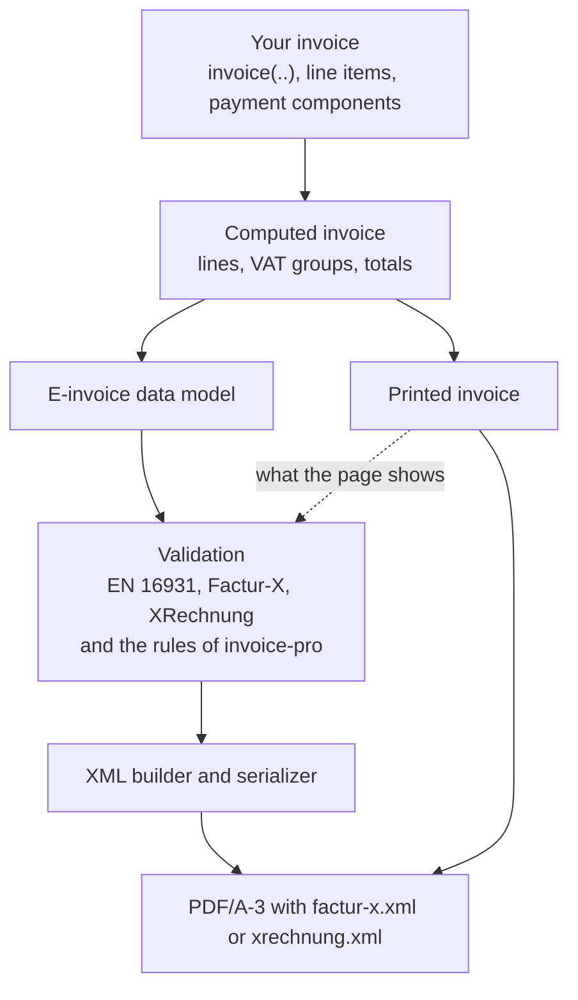

# How It Works

This page explains how `invoice-pro` creates an e-invoice and the principles that keep the printed invoice and its XML the same invoice. [Validation and Error Reporting](./validation.md) describes the checks while you compile, and [Testing and Conformance](./conformance.md) how the XML is tested.

## From Invoice to E-Invoice



1. **One computation.** `invoice-pro` computes the invoice once: the lines with their allowances and charges, the VAT groups and the totals. The printed invoice shows this result.
2. **The data model.** When `zugferd` is set, the computed invoice becomes the data model of the e-invoice. The model reads every quantity, price and amount from the computed invoice and computes none of them a second time. The only amounts the printed invoice does not state are the net amounts of an invoice with gross prices, which are derived once from the printed gross amounts (see [Gross Prices](./invoice-data/taxes.md#gross-prices)), and the sums of the lines, allowances and charges (BT-106 to BT-108). The model also makes texts given as content plain, normalizes identifiers (e.g. a VAT identifier without spaces) and resolves codes: units, countries, VAT categories, payment means.
3. **The validation.** The rules check the model and what the printed page shows, e.g. that it states the seller's tax number (see [Validation and Error Reporting](./validation.md)). They do not stop at the first problem, but collect every one. With `zugferd: auto`, the model is checked against the next profile while there are errors; the model is the same for every profile, so only the checks are repeated.
4. **The XML.** The builder turns the model into the element tree of a Cross Industry Invoice: its elements in the order of the Factur-X schemas, without what the schema of the profile does not know, numbers with a decimal point and the decimals the rules allow, dates in the format `102` (`YYYYMMDD`). The serializer writes the tree as XML text, with the texts escaped.
5. **The attachment.** The XML is attached to the PDF, which you compile as PDF/A-3b.

## Attaching the XML

`invoice-pro` uses Typst's native PDF attachment to embed the XML in the PDF:

```typst
pdf.attach(
  "/factur-x.xml",
  xml-bytes,
  relationship: "alternative", // "data" for MINIMUM and BASIC WL
  mime-type: "text/xml",
  description: "ZUGFeRD / Factur-X invoice data",
)
```

The recipient's software detects this embedded `/factur-x.xml` file and extracts all data without needing optical character recognition (OCR) on the visual layout. In the `"xrechnung"` profile, the file is named `/xrechnung.xml`, as ZUGFeRD 2.3 names the XML of its XRECHNUNG profile (and as Mustang embeds it). Earlier versions named it `factur-x.xml` in every profile.

The relationship `"alternative"` says that the XML is an equivalent form of the invoice. The XML of MINIMUM and BASIC WL, which state no invoice lines, only supplements the PDF, so it is attached with the relationship `"data"`.

If the XML has errors and you let the invoice compile anyway with `zugferd-errors: "report"`, the XML is attached as a draft instead: named `invoice-draft.xml` and with the relationship `"data"` (see [The `zugferd-errors` Parameter](./validation.md#the-zugferd-errors-parameter)).

## Principles

### The Printed Invoice and Its XML Are One Invoice

The XML takes every amount and quantity from the computed invoice that is printed, so it states exactly what the invoice prints: the quantity, price and net amount of every line with its allowances and charges, every allowance and charge of the document, the taxable amount, rate and VAT amount of every VAT category, and the totals. With gross prices (`tax-mode: "inclusive"`), the net amounts are derived from the printed gross amounts, and a net amount plus VAT gives the printed gross amount within the rounding described in [Gross Prices](./invoice-data/taxes.md#gross-prices). The tests check this on their invoices (see [Testing and Conformance](./conformance.md#the-test-oracle)), and an architecture test keeps the e-invoice modules from computing amounts of their own.

The same holds in the other direction for the details the law requires on the printed invoice: the validation checks that the page shows the seller's tax number or VAT identifier and the date of the supply that the XML states, that the service period it prints is the one the XML states, and that its amounts are printed in the currency the XML states (see [Printed Details](./validation.md#printed-details)).

### Stop Instead of Guessing

Where an input would give an XML that the official validators accept but that states something else than the invoice, `invoice-pro` reports an error instead of guessing. Some examples:

- A unit given as text that `invoice-pro` does not know is not written as "one" (`C62`), which the validators would accept (`IP-UNIT-02`).
- A misspelled key such as `vat_id` does not drop the VAT identifier without notice (`IP-KEY-02`).
- A party without `country` whose VAT identifier was issued by another country does not get the country of the locale (`IP-COUNTRY-01`).
- `tax: none` is not written as zero rated, as an e-invoice must say why no VAT is charged (`IP-TAX-01`).
- A title such as "Gutschrift" or "Angebot" without a `document-type` does not become a commercial invoice that asks the buyer to pay (`IP-DOC-01`).

These rules of `invoice-pro` have ids starting with `IP-`; [Validation and Error Reporting](./validation.md#rules-of-invoice-pro) lists them all.

### Official Rule Ids

Every problem is reported under the id that the official validators report for it, such as `BR-CO-25` or `BR-DE-15`, so you can look it up in the specifications and compare the listing with the report of a validator. The tests make sure that `invoice-pro` names only rules that the validators of the profile have, and that the validators reject an invoice that breaks such a rule with the same rule (see [Coverage of the Official Rules](./conformance.md#coverage-of-the-official-rules)).

### Self-Contained and Reproducible

The e-invoice is made in Typst alone: no Java, no network, no external tool, so it works offline and in the Typst web app. The code lists the validation needs are part of the package, generated from the official validators. The same input, Typst version and package version produce the same XML, and with a fixed creation timestamp the same PDF, bit for bit; the tests check this on every change.

### Only What the Invoice Needs

An invoice without `zugferd` loads none of the e-invoice code. An e-invoice loads the checks of inputs most invoices do not give, the messages of failed checks and the table of unit names only when it needs them. The performance gate of the tests fails when the e-invoice takes more than 15 % of the compile time of an invoice with 50 or 300 lines, or more than 25 % of any invoice; a short invoice with five lines currently spends about a tenth of its compile time on its e-invoice.

## What Is Checked Where

The package checks the input; the XML itself is checked by the tests of `invoice-pro`:

| Where                        | What                                                                                                                                                                                                   |
| :--------------------------- | :----------------------------------------------------------------------------------------------------------------------------------------------------------------------------------------------------- |
| While you compile            | The invoice data and what the page shows, against the business rules of the profile and the rules of `invoice-pro` ([Validation and Error Reporting](./validation.md)).                                |
| In the tests of every change | The XML of the test invoices against tables compiled from the official schemas and Schematron files, and some 900 invoices with the official validators ([Testing and Conformance](./conformance.md)). |

Checking the XML needs the tables of the official schemas and Schematron files and time on every compilation. Doing it in the tests keeps the package small and the preview fast, while the tests show on every change that the package writes valid XML for the invoices its rules accept: for the invoices of the test suite and of the conformance corpus.

## Modules

The e-invoice code is in `src/zugferd/` of the package:

| Module                                               | Role                                                                                                                                                                |
| :--------------------------------------------------- | :------------------------------------------------------------------------------------------------------------------------------------------------------------------ |
| `zugferd.typ`                                        | The entry point: builds the data model, runs the validation, chooses the profile for `auto` and builds the XML.                                                     |
| `model.typ`                                          | The data model: the e-invoice as a projection of the computed invoice, with the parties, identifiers, dates and codes resolved.                                     |
| `profile.typ`                                        | The profiles and what each of them can state.                                                                                                                       |
| `rules/`                                             | The validation: the checks most invoices need (`engine.typ`), those of rare inputs (`rare.typ`) and of XRechnung (`xrechnung.typ`), and the messages of every rule. |
| `code-lists.typ`, `code-lists.json`                  | The code lists of the validation (currencies, countries, units, schemes, payment means, exemption reasons), generated from the validators of each profile.          |
| `build.typ`                                          | The builder: the element tree of the Cross Industry Invoice, in the order of the schemas.                                                                           |
| `xml.typ`                                            | The serializer: escaping, numbers and the XML text.                                                                                                                 |
| `report.typ`                                         | The listing of the problems, as a compiler error or as the report in the document.                                                                                  |
| `document.typ`, `keys.typ`, `units.typ`              | Recognizing titles that name another document, misspelled keys of the parties, and units given as text.                                                             |
| `src/logic/net-amounts.typ`, `src/logic/printed.typ` | The net amounts of gross prices, and what the printed invoice shows for the checks of the printed details.                                                          |
